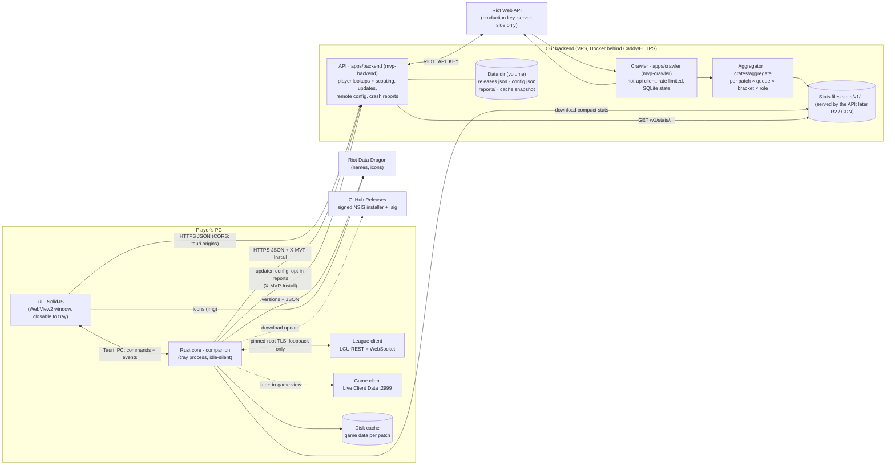

# Architecture



## Principles
- **The core owns data, the UI renders it.** Every UI-facing type lives in `crates/domain` and is
  exported to TypeScript; the UI reaches the core only through `ui/src/data/transport.ts`
  (Tauri IPC in the app, scripted mock scenarios in a browser, HTTP later for a web version).
  The mock only ships in browser builds (`pnpm dev`, `build:preview` for the UI tests, into
  `ui/dist-preview`); the desktop build (`pnpm build` = `vite build --mode app`, into `ui/dist`,
  the one the bundle budgets measure) leaves it out with the widget harness.
- **Light next to League.** No overlay, no injection, no polling loops in the UI; the webview can
  be closed while the core keeps following the client from the tray. Budgets and an idle-work
  test guard this in CI, plus a real-app memory/CPU check on Windows.
- **Privacy and policy by construction.** Hidden players' identities are never deserialized from
  the champ-select session. The Riot API key only exists on our server. See `policy.md`.
- **Stats are transparent.** The draft model (`crates/stats/src/draft`) is additive log-odds with
  empirical-Bayes shrinkage: every number comes with its games, weight and uncertainty.

## Backend API (`apps/backend`)
The only holder of the Riot API key. JSON, camelCase, types from `crates/domain` (so the UI gets
TypeScript types); failures answer `ApiError` `{ error, message, retryAfter? }`.

| Route | Answer |
| --- | --- |
| `GET /health` | `Health` `{ ok, version, riotKey }` |
| `GET /v1/players/{platform}/{gameName}/{tagLine}` | `PlayerProfile` · 400 bad platform · 404 · 429 + `retryAfter` · 503 without key |
| `POST /v1/players/batch` `{ platform, players: RiotId[] }` (≤ 10; older apps: `puuids`) | `ScoutCard[]` for loading-screen scouting |
| `GET /v1/stats/index` | `StatsIndex` (published patches, `current`) · ETag, `max-age=300` |
| `GET /v1/stats/{patch}/{queue}/{file…}` | published stats files (below) · ETag/304, `max-age=3600` · 404 when absent |
| `GET /v1/updates/{target}/{arch}/{version}?channel=` | 204 or the Tauri updater manifest (staged rollout, channels, blocked releases) |
| `GET /v1/config?version=&channel=` | `RemoteConfig` (feature flags, kill switches, min version, banners) · `ETag`/304 |
| `POST /v1/reports` | opt-in `CrashReport`, scrubbed of personal data, kept 30 days |
| `GET /metrics` | Prometheus text (admin address or bearer token) |

Scouting batches name players by **Riot ID**: the League client's PUUIDs are not our API key's
(Riot encrypts PUUIDs per key), so the server resolves each Riot ID with account-v1 (cached a
day) and builds the card from our key's PUUID. Cards carry the account's Riot ID next to that
PUUID and positive/neutral tags only (OTP, main role, hot streak, veteran); players nobody
knows get no card. Caches in memory with request coalescing: profiles and cards 2 min,
accounts 1 day, compacted match documents forever (LRU-bounded); accounts and matches are
snapshotted to the data dir on shutdown. Lookups share one rate limiter per routing value; a
429 is reported to the caller rather than waited out when Riot asks for more than 5 s.

Platform services (`apps/backend/src/ops.rs` and siblings) sit next to the Riot routes:
- **Updates:** releases are described in `releases.json` (edited by `mvp-backend release
  add|promote|block`), served in the Tauri v2 updater format. Staged rollouts bucket installs
  by `SHA-256(install id, version)`, so an install's answer is stable; beta follows stable too;
  blocked releases are never offered and never downgraded from (the fix is forced instead).
  The release workflow signs the installer (`createUpdaterArtifacts`, key in CI secrets).
- **Remote config:** `config.json`, validated at load and re-read when its mtime changes (no
  watcher, no polling); the app applies kill switches immediately.
- **Reports:** opt-in only, scrubbed (Riot IDs, PUUIDs, user names in paths, e-mails,
  credentials, IPs), per-install rate limited, daily JSONL files pruned after 30 days,
  erasable per install id (`mvp-backend reports forget`).
- **Hardening:** every request gets an id, a span and metrics; `/v1/*` is rate limited per
  `X-MVP-Install` (else IP) with 429 + `Retry-After`; body limits and a 45 s timeout; JSON logs
  in production; graceful shutdown.

Run, deploy, data dir layout and privacy: `apps/backend/README.md`.

## Backend client (`companion::backend`)
The app reaches the backend **from the core**, never from the webview: the UI calls Tauri commands
(`search_player`, `live_game`, `retry_scouting`, the stats commands below) and the core makes the
HTTPS request.
- **Base URL**: `MVP_BACKEND_URL` at **build time** (`MVP_BACKEND_URL=https://api… pnpm build:exe`);
  without it, `http://127.0.0.1:8787` (a local `pnpm backend`). **Debug builds** also read
  `MVP_BACKEND_URL` at run time, to point a dev app anywhere without rebuilding:
  `MVP_BACKEND_URL=http://127.0.0.1:8787 pnpm app`. The CSP's `connect-src` lists the local origin;
  add the production origin there once it exists (only needed if the webview ever calls it directly).
- **Install id**: a random 128-bit hex id in `install-id` next to `settings.json`, sent as
  `X-MVP-Install` on every request, the update check included (anonymous; lets the server
  rate-limit per install, stage rollouts and erase an install's crash reports). Settings shows it
  next to the crash-reports switch (`app_info.installId`) for deletion requests.
- **Timeouts**: connect 5 s, lookups 20 s, scouting batches 35 s (the server gives up at 30 s).
- **Errors** map to `domain::BackendError` (`notFound`, `rateLimited { retryAfter }`,
  `unavailable { message }`, `network { message }`); commands reject with it and the UI words it.

## Remote config, app updates and crash reports (app side)
All three run in the core, so they work with the window closed; the UI only shows them.
- **Remote config** (`companion::remote::RemoteConfigStore`): `GET /v1/config?version=&channel=stable`
  at start, then again after each answer's `pollAfterSecs` (one tokio timer in the core, 10 min
  after a failure), revalidated with `If-None-Match`. The last answer is kept in
  `remote-config.json` next to the settings and applies from the next start, before (or without)
  the network: a kill switch stays on while offline. A copy fetched for an older app version gets
  its `updateRequired` recomputed. The core applies it as it changes (`companion::Services.remote`):
  the `autoAccept` kill switch or feature flag stops a pending accept at once and wins over the
  player's setting; `scouting: false` skips the batch (the teams still show); `playerSearch:
  false` makes `search_player` answer `unavailable`; `draftHelper: false` publishes the draft
  without the helper's numbers (teams only); each import part stops when its flag is off or its
  kill switch on (`remote::import_allowed`: skipped as `paused`, never tried on lock-in). UI:
  `remote_config` + `remote-config`.
- **App updates** (`companion::updates::UpdatePlan`, pure and unit-tested; carried out by
  `apps/desktop/src/updater.rs` with tauri-plugin-updater): first check 30 s after start, then every
  6 h, at once when the config says `updateRequired`, or when the player asks (`check_for_updates`).
  Endpoint `{backend}/v1/updates/{{target}}/{{arch}}/{{current_version}}?channel=stable` with
  `X-MVP-Install`; `mandatory` is read from the manifest. **Never during a game**: nothing downloads
  or installs in ready check, champ select, loading or in game; a running download stops when one
  starts and resumes after. A downloaded update (verified with the public key) waits: the player
  restarts into it ("Update ready — Restart", `install_update`; the NSIS installer runs passive and
  reopens MVP), otherwise it installs when MVP quits (tray Quit, or closing without *close to
  tray*), without reopening it. The public key is `plugins.updater.pubkey` in
  `apps/desktop/tauri.conf.json` (empty until the key pair exists; how to make it: backend README,
  App updates). Debug builds, builds without that key and plain-HTTP backends report
  `unavailable` and never check. UI: `update_status` + `app-update` (`domain::UpdateStatus`).
- **Crash reports** (`companion::crash`, opt-in: `Settings.crashReports`, off by default): a panic
  hook writes a report to `crash-reports/` next to the settings (release builds abort right after;
  it goes out at the next start) or sends it at once when the app survives; the UI forwards its
  crashes (uncaught errors, rejections, crashed widgets, not expected failures) with `report_error`,
  and only while the setting is on (the core checks again). Reports are scrubbed before they
  leave (`crates/scrub`, the server's own rules), bounded to the server's limits, at most 10
  waiting and 5 sent per start; refused ones are dropped, rate-limited ones kept. Turning reports
  off deletes what waits. A report holds the error, the app and OS/webview versions and the
  install id, nothing about the Riot account.
- **UI** (`ui/src/app/Banners.tsx`, loaded lazily, and `app/notices/`): active banners at the top of
  the page frame (English text for now; `dismissible` ones close and stay closed by id in
  `localStorage`), the update prompt (hidden during a game, "Later" until the next launch), and,
  below the minimum version, a blocking-but-polite card over everything under the title bar with
  `minVersion.message` and the one action that fits (restart, check again, wait for the game to
  end). Links open in the browser through the core (`open_banner_link` takes a banner id, never a
  URL). Settings → About shows the update status with "Check for updates" / "Restart to update".

## Loading-screen scouting (`companion::live`)
When the phase reaches Loading or InGame the core reads `GET /lol-gameflow/v1/session` once per
game (both teams: PUUID, Riot ID, champion, position; spells from `playerChampionSelections`),
publishes a `LiveGame` (our team first), then asks `POST /v1/players/batch` for the visible
players **by Riot ID** and fills the cards in place (`live` event), matching each card back to
its seat by Riot ID (case-insensitive: the server answers with the account's own spelling).
The client's PUUIDs stay in the core (they identify the local player and pair spells): our
backend's API key can't read them. Streamer-mode players (`nameVisibilityType: HIDDEN`) are
dropped before anything else: no Riot ID, no PUUID, no lookup; players without a Riot ID (bots)
aren't looked up either. Champion select is never read for identities. The game ending clears
the view; a failed batch is shown in the page head with a retry (`retry_scouting`). The remote
config's `scouting` flag turns lookups off (the teams still show, without cards).

## Search (title bar)
Champions match locally and instantly (fuzzy: prefix, word, initials, subsequence); a Riot ID
(`Name#TAG`) adds a player row that is looked up in the background (debounced 300 ms) and fills in
place. The rows are a pure function of the typed text, so Enter always opens what is highlighted
when it is pressed. Lookups are shared with the player page (2 min in memory, failures not cached).
Recent searches (max 8) and the region live in `localStorage`.

## Stats pages (`ui/src/views/tierlist`, `ui/src/views/champions`)
The Tier list and Champions pages read the published stats through the core only (`stats_index`,
`tier_list`, `champion_stats`, event `stats-index`; see `transport.ts`); failures carry a
`BackendError` and read as "nothing published yet" (empty state) or an error with a retry.
- **Scope**: queue (420 ranked solo · 450 ARAM), rank bracket and the tier-list role filter are
  remembered in `localStorage["mvp.stats-filters.v1"]` (`lib/stats-filters.ts`) and shared by both
  pages. Links can set them: `#/tier-list?queue=450&role=middle`; on a champion page `role` picks the
  role tab instead (`#/champions?id=103&role=middle`), falling back to the champion's main role.
  The bracket starts from the settings' `statsBracket` (`lib/settings.ts`, set by the shell from
  `get_settings` and the `settings` event); one picked on the pages is saved with the setting it
  was picked over (`over`) and holds until that setting changes, which brings the pages to it.
- **Requests**: `lib/query.ts` keeps the last answer on screen while a newer one runs (switching a
  filter never blanks the page), drops answers to older keys and never triggers the app's
  Suspense. The `stats-index` event bumps a version in every request key: pages refetch when a new
  publication lands. No timers, no polling.
- **Tier list**: rows ranked by score within the role shown (a divider opens each tier), sortable
  columns (`aria-sort`), 50 rows then "Show all" (keeps the DOM small), each row a link to the
  champion in that role; win rate is the shrunk one with its games, a footnote explains score and
  grades.
- **Champion page**: hero (art, role tabs with their share of the champion's games, tier, win/pick/ban
  rates with their counts, patch), then for the chosen role: the full rune page (both trees, the
  chosen runes lit in the tree's color, shards; the next most played pages one click away), spells,
  skill max order and first points (keycaps), items (starting, core in order, boots, 4th/5th/6th),
  every option with win rate, games and pick share; matchups best/worst by the shrunk effect `d`
  (lane, vs jungler, duos; rows open the other champion). ARAM: no roles, no bans, no matchups.
  `/champions` without an id is a searchable grid with each champion's tier.
- **Runes** come from `GameData.runes` (Data Dragon `runesReforged.json`, cached with the patch;
  icons under `artBase/img/…`). Stat shards (5001–5013) aren't in Data Dragon: `lib/runes.ts` names
  them and `design/RuneIcon.tsx` draws them as glyphs (no Riot art).
- **Controls**: `design/Segmented.tsx` is the radio group used for every filter and tab (one tab
  stop, arrow keys, Home/End; the selection is a separate thumb element).
- **For later**: `views/champions/BuildSummary.tsx` (keystone + secondary tree, spells, max order,
  core items) is ready for the Live page (the local player's champion and role, the game's queue);
  an "Import" action (rune page, item set: HANDOFF job 5) belongs in the Runes card header, next to
  the page's numbers. `#/__harness?show=<widget>` shows any registered widget alone (mock builds).

## Settings and automations
- **Settings** (`domain::Settings`) are owned by the core: `companion::settings::SettingsStore` loads
  `settings.json` from the app config dir at start (missing/corrupt → defaults), saves every change
  atomically (temp file + fsync + rename) and publishes it on a watch channel. The UI reads and
  writes them with `get_settings` / `update_settings` and follows the `settings` event. Opt-ins
  (`autoAccept`, `crashReports`) are off by default. `statsBracket` (Emerald+ by default, Diamond+,
  Master+; files saved before it load with the default) is whose games the stats count: the draft
  helper, its compositions and build imports switch to it at once; the stats pages start from it.
- **Automations** run in the core (`companion::automation`), so they work with the window closed:
  auto-accept (opt-in, delayed, once per ready check, see policy.md), build imports on lock-in
  (opt-in per part, see "Build imports" below) and the `Autopilot`, which
  turns gameflow phases into window intents: focus in champ select, Draft → Live → Home as the game
  goes. The UI reports every view it shows (`view_changed`), so a page the player opened is never
  switched away from.
- **Shell**: the window is created on demand (launch, tray, champ select); closing it frees the
  webview and, with *close to tray*, the app stays in the tray. A `navigate` event moves the UI; a
  window created for an intent opens directly on its view. *Launch at startup* uses
  tauri-plugin-autostart and starts in the tray (`--autostart`).

## Languages (`ui/src/i18n`)
English and French, for every word the player reads (views, states, toasts, tooltips,
`aria-label`s). Riot's own names (champions, items, spells, runes) come from Data Dragon in the
same language.
- **Catalogues**: `en.ts` + `en-views.ts` are the source, nested objects of strings and small
  functions for anything carrying a value (plurals, agreement, French elision `d’Ahri`), always
  whole sentences. `fr.ts` + `fr-views.ts` have exactly their shapes (`satisfies`): a missing or
  extra key fails the typecheck. `catalogue.test.ts` walks both (same keys, same arities, every
  function called with samples, no empty text, French only equal to English for a listed set of
  shared terms such as ARAM, Draft or KDA, French typography: a no-break space before `: ; ! ? %`
  and inside « », ’, …).
- **Reading**: components read `t().section.key`, a signal: switching the language re-renders the
  text in place, no reload. Setting the same language again keeps the same words object (every
  `settings` event re-sends it), so nothing re-renders.
- **Loading**: the first screen's words (shell, title bar search, Home) are in the startup
  bundle, in English; the other views' words load with the first of those views (their lazy
  loaders await `loadViewWords`, and Draft and Live preload at startup); French loads only when
  it is on (a few KB each, before the first frame when it is the saved language).
- **Setting**: `Settings.language` (`auto` | `en` | `fr`, default `auto`), kept by the core like
  `effects`, with a local copy in `localStorage["mvp.language"]` so the first frame is in it.
  `auto` follows the webview's language (`navigator.language`, the system's): French when it
  starts with `fr`. Settings → App → Language: Auto / English / Français, each in its own words.
- **Formatting** (`lib/format.ts`, `lib/days.ts`, with `Intl`): English as before (`54.6%`,
  `3,244`, `127K`, `5m ago`, `12 Sep`); French `54,6 %`, `3 244`, `127 k`, `1,9 M de parties`,
  `il y a 3 h`, `hier`, `12 sept.` (a number and its unit never part at a line end). Durations
  stay `29:02`. CSS values are never formatted.
- **Game data**: `game_data { language }` is asked in the UI's language (`auto` resolved there);
  the core loads Data Dragon in `en_US` or `fr_FR` (the disk cache keeps each locale under its
  patch), emits `game-data` again when another language is asked for, and falls back to English
  names offline before a language's first download. The browser mock stays English.
- **The core's own words** follow the same answer (`UiLanguage` in `apps/desktop/src/core.rs`,
  set by `game_data`): the tray menu (Ouvrir / Quitter) and the block titles of MVP's item set in
  the League client's shop (`companion::imports::item_sets`). English until the UI says.
- **Server texts**: the remote config's `LocalizedText { en, fr }` (banners, `minVersion`) shows
  in the current language (`localized`), English when the French one is empty.
- **Still English**: errors worded by the core (shown inside a translated sentence), MVP's rune
  page and item set names and the item set's block titles in the League client, the tray menu.
- **Room**: French runs about a fifth longer than English. Where a label is tight, French gets
  its own shorter words (`Solo/Duo` next to a rank, `Taux de ban`) rather than an ellipsis, and
  lines that can grow wrap (the champion hero's stat details go under their label while the hero
  is narrower than 1100 px).
- **Tests**: the `*-fr` Playwright projects (`locale: "fr-FR"`, so `auto` picks French) run
  layout (views × sizes at 400, 820, 1280 and 2560 px), coherence, errors and interactions in French;
  specs read expected words from the `t` fixture (`tests/app.ts`). `pnpm screenshots` also writes
  the main screens in French (`fr-*.png`).

## Glass and light (`ui/src/design/backdrop`, `ui/src/design/liquid`)
Two layers, one budget: **idle means idle** (nothing is scheduled at rest; the perf suite asserts
0 backdrop renders over 3 s and no script, style or layout work), and every moving part runs on
the compositor (transform/opacity, GPU filters).

**Optics** (`liquid/optics.ts`, pure, unit-tested): a glass pane floats above the page (its
`elevation`), seen from above. Its top is flat and curves down to its flat underside across a
bezel (a squircle profile for panes, a parabola for drops, a circle for card edges). The view ray
refracts where the surface slopes (Snell's law, index 1.5), crosses the glass, refracts again
leaving the underside and crosses the gap of air to the page, landing further inside: what is
under the rim is pulled inward and squeezed, and a parabolic drop magnifies evenly like a loupe
(≈ ×1.3 floating 0.6 of its radius up). Most of the visible bend comes from the gap (a sheet
lying on the page bends ~10 px at most; floating 10–12 px up, the rim bends 10–40 px). Past a
grazing angle the underside would reflect everything back (total internal reflection): capped so
the rim's last pixel stays finite. The rim reflects more at grazing angles (Fresnel, Schlick).
The curves are sampled into small tables shared by the two layers below, so they bend light alike.

**Liquid glass over the page** (`liquid/liquid.ts` registers elements; `liquid/lens.ts`, loaded
with the first lens, builds filters from `liquid/maps.ts` + `liquid/filter.ts`): floating chrome
and controls bend the real page behind them. Each element gets an SVG filter used as its CSS
`backdrop-filter` (`backdrop-filter: var(--lg-filter, <plain frost>)`): a light frost → the
displacement map → a deeper frost where the glass is thick (`frostCore`) → vibrancy (saturate,
brightness; inside the filter: Chromium drops a `url()` backdrop filter chained with CSS filter
functions) → the glass' tint → rim light.
- **The map** (nine slices: four corners, four one-pixel edges stretched along, a flood for the
  middle; cached data-URL images at the screen's density, up to 2×, so the bend is as precise as
  the pixels) holds the pull in red/green and, in blue, how much tint the glass shows: none at the
  rim, easing in across the bezel, so the band where the light bends stays clear.
- **Frosted core** (`frostCore`): the map's blue weights a strong blur of the page, so the rim
  (thickness 0) stays sharp and visibly bent while the middle, where labels sit, is calm.
  Nothing bends there anyway, so it costs no optics: bent at the edges, legible in the middle,
  like iOS glass.
- **Tint**: declared once in the element's CSS (`--lg-tint: <token>` with
  `background: var(--lg-fill, <token>)`); while the lens runs, liquid.ts sets `--lg-fill:
  transparent` and the filter paints that tint scaled by blue. Text-heavy panes (search, toasts)
  keep a deep middle for reading; `--bg-clear` panes over art let the art through.
- **Rim light** comes from the same map: red/green are the outward normal scaled by steepness,
  so a colour matrix gives `normal · light` (light from the top left, a third of it on the far
  rim), sharpened with a gamma and added on top. The CSS `glass-rim` ring stays as the crisp edge.
- The optical outline rounds corners at least as much as the bezel is wide (smooth normals, no
  crease along the corner diagonal); a drop is a stadium.
- Kinds (`LIQUID`): `bar` (title bar: a 10 px lower rim; content scrolling under it stretches
  along that rim, the rest is frosted), `dock` (the rail and the floating tab bar: 12 px rims,
  frosted middle), `panel` (search results, toasts: 12 px rims matching their corners, frosted
  middle), `clear` (rank pane and champion tier over art: a wide 20 px bent rim, corners
  `--radius-5` to match, a light frost in the middle for their captions), `lens` (rail selection,
  segment thumbs, held switches: a loupe, tinted with light so a choice reads lit, never as a
  hole). No colour split over the page (over text it reads as fringing).
- **Icons and text stay crisp**: a drop sits *behind* the labels of the rail and of segmented
  controls at rest, and lifts over them (magnifying what it passes) only while it glides
  (`data-moving`, from the WAAPI glide or the thumb's `transform` transition). A held switch's
  knob swells into a drop over the track.
- Nothing that carries a lens has an outer box-shadow: Chromium shifts the SVG filter by the
  shadow's reach. Shadows sit on a wrapper; the glass is a layer inside (tested).
- The page scrolls **under** the title bar (`main` spans both rows, padding-top = bar height),
  which bends it along its lower rim. Sticky side columns stick below the bar.
- An element with a backdrop filter hides the page from its descendants' glass (backdrop root),
  so glass is always a layer inside its element, never the element itself.
- Motion (`design/motion.ts`): springs sampled into CSS `linear()` easings (`--ease-spring`, and
  `--ease-glide` critically damped for thumbs that must stay in their track; both kept in sync
  with the code by a unit test). Reduced motion jumps.
- On only with the shader (`data-effects="shader"`); otherwise the same elements keep a plain
  CSS blur (`light`) or none (`off`), and the lens code is never downloaded.
- **Glass lab** (dev server only): `pnpm dev` → `#/__harness?show=glass` shows every kind over
  art, text and straight lines, draggable, to see how each shape bends what is behind it.

**The window backdrop** (`backdrop/`): one WebGL 1 canvas (first child of `[data-ambient-host]`,
fixed, `z-index: -1`, `aria-hidden`, `data-free-style`), drawn **on demand only**.

## Logs and diagnostics (`apps/desktop/src/{logging,diagnostics}.rs`)
- The desktop app logs to stdout (debug builds) and to `mvp.log` in the app's log folder
  (`app_log_dir`: `%LOCALAPPDATA%\gg.mvp.companion\logs`): a release build has no console. The
  previous run's file is kept as `mvp.previous.log`; a run stops writing past 16 MB (one line
  says so). `RUST_LOG` sets the filter (default `info,scout_desktop=debug`).
- Settings → About → "Copy diagnostics" (`diagnostics` command): app, OS and webview versions,
  install id, the League client's state, backend URL, stats patch, game data version and locale,
  emblems on disk, settings, and the log's last 200 lines passed through `scrub` (Riot IDs,
  PUUIDs, IP addresses, user folders). The UI copies it (clipboard API, else a text area and
  `execCommand`). "Open log folder" (`open_logs`) opens the folder in Explorer.

## Ranked emblems (`static_data::emblems`, `ui/src/design/RankEmblem.tsx`)
- **Riot's art, at run time**: at start the desktop core loads the ten tier emblems
  (`RankEmblems::load`): from its cache (`<app cache>/emblems/v1/emblem-<tier>.png`), else from
  `CommunityDragon`'s mirror of the League client files (`…/rcp-fe-lol-static-assets/global/default/
  ranked-emblem/emblem-<tier>.png`; the older `images/ranked-emblem` folder is tried next). The
  client's 16:9 canvases are cropped to the crest (one window for every tier, x 37–63 %, y 30–65 %,
  which keeps the client's hierarchy: higher tiers are bigger) and scaled to 192 × 144 (sharp at
  80 × 60 on a 2× screen), then cached. A tier that fails is left out; offline, the cache serves.
  Bump `CACHE_DIR` to fetch again (new art or another window).
- The UI gets them as data URLs (`rank_emblems` command, `rank-emblems` event when they arrive;
  `ui/src/data/emblems.ts` asks once per session). The app's CSP already allows `data:` images.
- **`RankEmblem`** (`tier | "unranked"`, `sm` 48 × 36 · `md` 64 × 48 (Live cards) · `lg` 80 × 60 ·
  `xl` 96 × 72 (Home; the core's 192 × 144 at 2×)) shows Riot's art when it has it, else MVP's
  crest in the same box (`data-emblem="riot" | "crest"`), so nothing moves when the art arrives.
  The crest: a metal rim around an enamel field in the tier's colour and a cut gem lit from the
  top left, the brightest thing in it (defined once for the page: a hidden SVG with each tier's
  metal and enamel gradients and `#rank-body`); ornaments per tier (crowns, blades, wings,
  horns); a contact shadow, and a glow only from Master up. Colours are mixed from the tier
  tokens (`--rank-<tier>`). No rank: an empty slot, not a dimmed Iron.
- Mock scenarios: none by default (the crest shows), `?scenario=emblems` stands in stylized
  emblems (no Riot art in the repository). Dev lab: `#/__harness?show=emblems` (every tier,
  crest and art, at every size).

## Build imports (`companion::imports`)
MVP writes a champion's build into the League client: its own rune page, its item set for the
champion, the summoner spells (policy: docs/policy.md, "Build imports"). The UI asks with
`import_build { request: ImportRequest { championId, role, queue, parts } }` and gets an
`ImportResult`, one outcome per part: `saved { name }`, `spellsSet { spellIds, changed, flash }`,
`skipped { reason }` or `failed { reason }` (structured; the UI words them in
`ui/src/lib/imports.ts`). The lock-in automation sends the same result as an `import` event
(`automatic: true`): a toast anywhere, and the Draft bar's buttons.
- **Builds** come from a `BuildSource` trait: `build(champion, role, queue, bracket) ->
  Option<BuildStats>` (`role: None` = the most played role; queue 420 for every Summoner's Rift
  mode, 450 for ARAM, from the gameflow session's `gameData.queue.mapId` when the request has
  none; other maps have no builds; the request's `bracket`, Emerald+ without one: a champion page
  imports the bracket it shows). The desktop wires the stats client (`StatsClient` implements it:
  the current patch's `builds/{id}.json` of the queue and bracket) into `companion::Services`;
  `imports::build_for_role(&BuildsFile, role)` picks the role's build from a published file.
- **Rune page**: `runes.top[0].ids` = `[primaryStyle, subStyle, 4 + 2 perks, 3 shards]` → a page
  named like `MVP · Ahri Mid` (≤ 25 characters, `ARAM` instead of a role there). MVP's page is the
  first editable page whose name's first word is "MVP" (any case): replaced with
  `PUT /lol-perks/v1/pages/{id}`, its other fields kept. Without one: `POST /lol-perks/v1/pages`
  if the inventory has room (`canAddCustomPage`, else custom pages < `ownedPageCount`), else
  `noFreePage`. Then `PUT /lol-perks/v1/currentpage`. Nothing is ever deleted.
- **Item set**: blocks *Starting items* (with counts), *Core build (in order)*, *Boots*,
  *Situational* (4th–6th items by games, at most 6); tied to the champion and map 11 (12 for
  ARAM). The document is read, MVP's set for the champion replaced (one per champion, whatever
  the role), and `PUT` back whole: every other set and field as read, `timestamp` now.
- **Spells**: champion select only (the core's phase, then a live session). Time left =
  `adjustedTimeLeftInPhase − (now − internalNowInEpochMs)`; refused with `LAST_SECONDS` (5) or
  less, or in `GAME_STARTING`, checked again right before the `PATCH …/my-selection`. Flash key:
  the setting (D/F), else the key Flash sat on in most of the client's recent Summoner's Rift and
  ARAM games, else where it is now, else F with a `guessed` note; `keptOnYourKey` when the build
  lists it on the other key, `notInBuild` without Flash. Already set: no write.
- **On lock-in** (`LockIn`, fed with every champion select session the core loop sees): a lock is
  the local player's completed pick action (or no pick action at all, as in ARAM) with a
  champion. `LockTracker` handles each locked champion once per champion select; a new champion
  (trade, ARAM swap) aborts the previous import and starts its own. The parts set to "on
  lock-in" run in one task. Spells locked with 7 s or less left in a phase before finalization
  wait for the next session event with time on the clock (the next turn, or finalization).

## Window backdrop (`ui/src/design/backdrop`)
The ambient light behind the shell is one WebGL 1 canvas (first child of `[data-ambient-host]`,
fixed, `z-index: -1`, `aria-hidden`, `data-free-style`), drawn **on demand only**. Nothing runs at
rest: no rAF loop, no timers (the perf suite asserts 0 renders over 3 s, and a median render
≤ 2 ms of CPU).
- **What wakes it**: the page light changing (a MutationObserver on the host's inline `--amb-*`,
  written by `ambient.ts`; the 450/600 ms glide is mirrored in JS, a frame each only while it
  runs), a ResizeObserver on the host and on the glass panes, a DOM change under the host (panes
  come and go), and scrolling of a container that holds panes (rAF-coalesced).
- **Two cheap passes**: (1) the light, glows bent by 2 octaves of value noise with a faint satin
  sheen, into a texture at 1/8 of CSS px, redrawn only when the light or the window size changes;
  (2) per render, into a canvas at ½ CSS px (device pixel ratio capped at 1, scaled up by CSS): the
  texture with a dither, then one quad per glass card in a single draw call. Cards are elements
  marked `data-refract` (`="chrome"` for the rail; at most 16). Inside a card's rim the backdrop
  is seen through thick glass: the optics table (a 64×1 texture) gives the inward bend and the
  reflectance across an 18 px bevel; the bend is split slightly by colour, the rim gathers the
  light it bends and catches the page light on the side facing it. Everything scales the light's
  difference from `--bg-0`, so dark areas and text backgrounds stay as they were. Cards add a
  crisp 1 px rim of light in CSS (`.glass-rim`).
- **Levels** (`Settings.effects`, owned by the core; a copy in localStorage `mvp.effects` so the
  first frame matches; shown on `<html data-effects>`; Settings → App → Visual effects): `auto`
  ("Full", default) → `shader`, falling back to `css` when WebGL is missing, the first frame takes
  more than 8 ms GPU included (software rendering, weak GPU), or the context is lost (back to
  `shader` when restored); `prefers-reduced-transparency` → `css`; `prefers-reduced-motion` keeps
  the shader but skips glides. `light` → `css`, static gradients and plain blur. `off` → `flat`:
  `--bg-0` only, no blur, opaque floating panels. `data-effects-fallback` says why a fallback
  happened (Settings words it).
- **Tests**: headless Chromium renders with SwiftShader, which the speed probe rightly rejects, so
  `tests/app.ts` sets `window.__MVP_TRUST_WEBGL__` to keep the shader in every suite
  (`webgl: "probe" | "missing"` exercises the fallbacks, `tests/backdrop.spec.ts`, which also
  checks the lenses per level, the rail lens following navigation and the held switch).

## Stats pipeline (`apps/crawler` + `crates/aggregate`)
Server-side only (the Riot key never leaves it). Checkpoint 2 scope: **Emerald+**, ranked solo
(420) and **ARAM** (450), current patch with fallback to the previous one.

```text
crawl:   ladder pages (Emerald I–IV, Diamond I–IV, Master/GM/Challenger) → PUUIDs
         → match ids (420 + 450, last N days) → match + timeline → GameFacts → SQLite
publish: SQLite facts of a patch (+ the previous patch) → Dataset → JSON files → STATS_DIR/v1/…
serve:   mvp-backend GET /v1/stats/… (ETag, Cache-Control) → the app downloads and caches
```

- **Crawl state** (`{data dir}/crawl.sqlite`, rusqlite bundled): ladder pages read, players (with
  the bracket they were seeded from and when their history was last read), pending match ids,
  and every fetched match (primary key = match id → never counted twice) with its extracted
  facts or the reason it isn't counted. Any run can stop anytime and the next one resumes. Every
  call goes through `riot-api`'s header-driven limiter; the crawler waits out 429s (a dev key
  just crawls slowly). Brackets are rotated so each gets its share.
- **Facts** (`aggregate::extract`): patch from `gameVersion` (`16.19.712.4` → `16.19`, public
  `26.19`), queue, bans (once per game), and per player: team, win, champion, `teamPosition`,
  spells, full rune page, skill level-ups and net purchases (undos removed) from the timeline;
  the game's length and, per player, damage to champions by type, damage taken and
  self-mitigated, and `timeCCingOthers` (every player of a game or none: a team's shares need
  every teammate; facts crawled before have none and are left out of those aggregates, never
  counted as zero). No PUUIDs or names are kept. Skipped: other queues, remakes (< 5 min or
  early surrender), ranked games without one of each role per team. A game counts in the
  bracket of the ladder player who surfaced it first (Match-V5 has no rank); brackets publish
  cumulatively (`emeraldPlus` ⊇ `diamondPlus` ⊇ `masterPlus`).
- **Aggregates** (`aggregate::Dataset`, per patch × queue × seed bracket): champion × role
  games/wins (pick counts, role odds), bans, lane-relevant opponents (same role, laner vs enemy
  jungler, bottom vs support), same-team duos (all 10 role pairs), and builds per champion ×
  role: rune pages, keystones, spell pairs, skill max order and first four points, starting
  items (< 1:30), core (first three completed legendaries in order), first upgraded boots, and
  the 4th/5th/6th legendary. Items are classified with the patch's Data Dragon `item.json`.
  Compositions per champion × role (ARAM: no role): games with the numbers, damage by type, damage
  soaked as a share of the team's (basis points), crowd control, games/wins per game-length bucket
  (ranked: under 25, 25–35, 35+ minutes; ARAM: 17 and 22).
  Every count is a sum, so `merge` is commutative and results don't depend on game order
  (property-tested); build options are bounded by `compact` (top N + a tail count).
- **Published files** (`aggregate::publish`, types in `crates/domain/src/stats.rs`, exported to
  TS): compact keys (`g` games, `w` wins), raw counts next to every derived number.

| Path under `STATS_DIR` | Type | Contents |
| --- | --- | --- |
| `v1/index.json` | `StatsIndex` | patches (newest first) with games per `{queue, bracket}`, `current` (newest patch with ≥ 20k Emerald+ ranked games, else the previous) |
| `v1/{patch}/{queue}/{bracket}/champions.json` | `ChampionsFile` | per champion: games, wins, bans, roles (g/w, previous patch g/w); draft priors τ/k per pair type (DerSimonian–Laird via `stats::draft::estimate_tau`) |
| `…/tierlist.json` | `TierList` | champion × role: score = shrunk win rate − 50 % (k = 1000), grade S–D, games, pick/ban rates |
| `…/matchups/{championId}.json` | `MatchupsFile` | ranked only; per role: lane, vs enemy jungler, duos — g/w and the shrunk delta `d` in points |
| `…/builds/{championId}.json` | `BuildsFile` | per role: runes, keystones, spells, skills, skill start, starts, core, boots, item 4/5/6 — each `{ n, top: [{ ids, g, w }] }` |
| `…/compositions.json` | `CompositionsFile` | per champion × role (ARAM: no role) with enough games: `n`, damage to champions per minute (physical, magic, true), `front` (mean share of the team's damage taken + mitigated), `cc` (seconds per game), `len` (g/w per length bucket, bounds in `lengths`); `roles`: each whole role as the usual pick. Published once games carry the numbers |

`{bracket}` is `emeraldPlus`, `diamondPlus` or `masterPlus`. Each patch directory is replaced
atomically on publication; the index is written last.

**Deployment:** a systemd timer on the VPS runs crawl → publish every 3 hours in the crawler's
Docker image, writing into the backend's data volume (`STATS_DIR=/data/stats`), with an optional
`rclone sync` to Cloudflare R2 (credentials only on the VPS): `apps/crawler/README.md`.
**Next (not built):** point the app at the CDN copy; per-platform crawls merged for more volume.

## Stats in the app (`companion::stats`, `companion::draft`)
The core downloads the published files through the backend client (same base URL, install id,
timeouts and `BackendError`s) and the UI asks the core, never the backend:

| Command / event | Answer |
| --- | --- |
| `stats_index` | `StatsIndex \| null`: the index as last fetched (`null`: nothing published, or offline without a cached copy); a stale one is revalidated in the background |
| `tier_list { queue, bracket }` | `TierList` of the current patch · rejects with a `BackendError` (`notFound` when neither published nor cached) |
| `champion_stats { championId, queue, bracket }` | `ChampionPage` from `champions.json` (record), `tierlist.json` (its rows, best role first), `builds/{id}.json`, `matchups/{id}.json` (ranked only); an unpublished file leaves its part empty, `notFound` only when the data set doesn't exist |
| event `stats-index` | `StatsIndex`: a different index arrived (new patch, republication): stats views refetch |

- **Disk cache** under the app cache dir, in the server's layout: `stats/v1/index.json`,
  `stats/v1/{patch}/{queue}/{bracket}/{file}`, each with its `ETag` in `{file}.etag` (atomic
  writes). Only the index's current patch and the one before it stay on disk.
- **When the network is used** (never on a timer): the index at startup (`If-None-Match`), then at
  most once per its `max-age` (5 min) when something asks for stats, e.g. champion select
  starting; a stale index answers at once and is revalidated in the background. Data files don't
  change within a publication and carry its time (`info.updatedAt` = the index's
  `PatchIndex.updatedAt`): a cached file of the current generation is served with no request;
  otherwise `If-None-Match` (304 → the disk copy), and a 404 is remembered for that generation.
  Requests for one file are coalesced; a 429 pauses every request for its `Retry-After` (the
  backend allows 60 at once, 120/min per install, shared with lookups). Parsed files live in a
  64-file LRU.
- **Offline or failing**: the cached copy (any generation), else the previous patch's copy,
  else the error.

**Draft helper** (`companion::draft`, a task of its own next to the core's event loop): the loop
maps each champ-select session (teams only) and hands it over; the helper re-publishes it at
once when nothing the model reads changed, else after one evaluation on a blocking thread
(~1 ms per pick in release). What it adds to `DraftView`: `team` (our win chance: locked picks
and allies' hovers; your own hover only once you lock in), `suggestions` (≤ 15, tiers of
statistically tied picks, reasons), `data` (bracket, public patch name, games, updated) and each
enemy's `role`/`roleOdds` (≥ 5 %).
- **Data**: the game's queue (the gameflow session's, else ARAM for a champion select with a
  bench; modes without stats get none), the settings' `statsBracket` (Emerald+ when that one isn't
  published: `data.bracket` names the one used; a change mid champion select reloads at once),
  current patch. Ranked: `stats::draft::DraftData` over
  `champions.json` (base strength = this patch shrunk toward the previous patch's win rate in
  the role, which is itself shrunk toward 50 % — 47 % off-meta — with 1k games; prior strength
  `n_prev·k_d/(n_prev+k_d)`, `k_d` = 20k, 1.5k when the win rate moved with |z| > 3) and the
  published pair priors; pair evidence from the `matchups/{id}.json` of the champions in the
  draft, both perspectives averaged (a laner's file is the only one with its games against the
  enemy jungler, so the candidates' files load too once an enemy is locked). Enemy roles from
  each champion's role shares over every consistent assignment.
- **Candidates, pool-first**: your hover/pick, your recent Summoner's Rift games in the role
  (`/lol-match-history/…`), your mastery on champions that play the role (≥ 10 % of their
  games), then the role's tier list so the list is never empty — only champions you can pick
  (`/lol-champ-select/v1/pickable-champion-ids`, not banned, not taken). `mine` = your games on
  the pick in the role, `mastery` = your mastery of it. No ban suggestions.
- **Loads**: at champ-select start, the pool (3 LCU reads) and the data set (index, champions,
  tier list); matchups files as champions appear (≤ 4 in flight). Arrivals within 30 ms are
  evaluated once. Without stats (no backend, nothing published, offline without cache) the draft
  shows the teams only (`data: null`, no suggestions); without assigned roles (blind), no
  suggestions.
- **Compositions** (`companion::stats::comp`, `DraftView.comps`, informational: never in the
  estimate): each team from `compositions.json`, allies in their seats' roles, enemies over their
  likely roles; locked picks and hovers (marked `hovering`: "what does my hover change?").
  Damage mix, frontline against usual picks in the same roles (1 = usual, so three picks read like
  five), crowd control (and the usual picks'), each length bucket's win-rate change (shrunk toward
  the champion's own rate with 1k games) summed in points. Readings as data from three counted
  champions: mostly physical/magic (≥ 70 %), little/lots of frontline (< 0.85 / > 1.15) or crowd
  control (< 0.7 / > 1.3 × usual), stronger in short/long games (≥ 3 points apart). Each
  suggestion carries your team's composition with it in your seat (`comp`). Not published yet:
  `comps: null`.
- **ARAM** (`enrich_aram`): your champion and the bench's (`benchChampions`; `bench`, `rerolls`
  in the view) as suggestions, ranked by the team's chance with each: σ(Σ the champions' ARAM
  base logits) against an average team (the enemy team is hidden), tiers of ties within one SD,
  the "why" = the champion's own ARAM strength over its games, with mastery and the composition.
  Informational only: nothing is swapped or picked for the player.
- **Draft UI** (`views/draft`): the side panel has two tabs, *Pick* (the selected pick's terms, the
  team with it) and *Teams* (`Comps.tsx`: both compositions side by side, every number with its
  title, the bracket and patch under them; ARAM: yours only). A pick clicked beside the list opens
  *Pick*; on narrow windows the panel is stacked last and opens on *Teams* (rows explain
  themselves inline).

## Crates
| Crate | Role |
| --- | --- |
| `domain` | UI-facing types (serde + ts-rs) |
| `lcu` | League client: discovery, pinned TLS, REST, WAMP events, connector lifecycle |
| `mock-lcu` | fake League client for tests and development |
| `companion` | Tauri-free core: client status, champ select → `DraftView` (+ draft helper), loading screen → `LiveGame`, settings, automations, build imports, backend client, stats download + disk cache, remote config, crash reports, update policy |
| `scrub` | removes personal data (Riot IDs, PUUIDs, user names in paths, e-mails, credentials, IPs) from crash reports, in the app and on the server |
| `static-data` | Data Dragon download (champions, items, spells, rune trees) + per-patch cache + offline fallback |
| `stats` | statistics and the draft model |
| `aggregate` | stats pipeline core: Match-V5 → facts → mergeable aggregates → published JSON |
| `riot-api` | Riot Web API client for the backend (rate limits, retries) |
| `players` | Riot data → `PlayerProfile` / `ScoutCard` (behind a `RiotSource` trait the backend caches) |
| `apps/desktop` | Tauri shell: window, tray, commands, event bridge |
| `apps/backend` | `mvp-backend` HTTP service: player lookups, scouting, published stats files (key server-side), app updates, remote config, crash reports, admin CLI |
| `apps/crawler` | `mvp-crawler`: crawl (Riot API → SQLite) and publish (→ `stats/v1/…`) |
