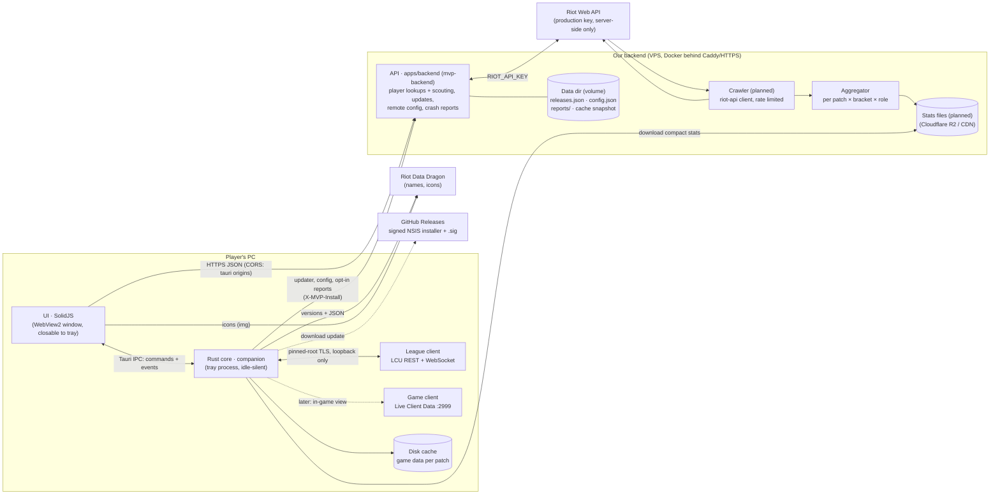

# Architecture

## Principles
- **The core owns data, the UI renders it.** Every UI-facing type lives in `crates/domain` and is
  exported to TypeScript; the UI reaches the core only through `ui/src/data/transport.ts`
  (Tauri IPC in the app, scripted mock scenarios in a browser, HTTP later for a web version).
- **Light next to League.** No overlay, no injection, no polling loops in the UI; the webview can
  be closed while the core keeps following the client from the tray. Budgets and an idle-work
  test guard this in CI, plus a real-app memory/CPU check on Windows.
- **Privacy and policy by construction.** Hidden players' identities are never deserialized from
  the champ-select session. The Riot API key only exists on our server. See `policy.md`.
- **Stats are transparent.** The draft model (`crates/stats/src/draft`) is additive log-odds with
  empirical-Bayes shrinkage: every number comes with its games, weight and uncertainty.

## Backend API (`apps/backend`)
The only holder of the Riot API key. JSON, camelCase, types from `crates/domain` (so the UI gets
TypeScript types); failures answer `ApiError` `{ error, message, retryAfter? }`.

| Route | Answer |
| --- | --- |
| `GET /health` | `Health` `{ ok, version, riotKey }` |
| `GET /v1/players/{platform}/{gameName}/{tagLine}` | `PlayerProfile` · 400 bad platform · 404 · 429 + `retryAfter` · 503 without key |
| `POST /v1/players/batch` `{ platform, puuids ≤ 10 }` | `ScoutCard[]` for loading-screen scouting |

| `GET /v1/updates/{target}/{arch}/{version}?channel=` | 204 or the Tauri updater manifest (staged rollout, channels, blocked releases) |
| `GET /v1/config?version=&channel=` | `RemoteConfig` (feature flags, kill switches, min version, banners) · `ETag`/304 |
| `POST /v1/reports` | opt-in `CrashReport`, scrubbed of personal data, kept 30 days |
| `GET /metrics` | Prometheus text (admin address or bearer token) |

Scout cards carry the Riot ID next to the PUUID and positive/neutral tags only (OTP, main role,
hot streak, veteran). Caches in memory with request coalescing: profiles and cards 2 min,
accounts 1 day, compacted match documents forever (LRU-bounded); accounts and matches are
snapshotted to the data dir on shutdown. Lookups share one rate limiter per routing value; a
429 is reported to the caller rather than waited out when Riot asks for more than 5 s.

Platform services (`apps/backend/src/ops.rs` and siblings) sit next to the Riot routes:
- **Updates:** releases are described in `releases.json` (edited by `mvp-backend release
  add|promote|block`), served in the Tauri v2 updater format. Staged rollouts bucket installs
  by `SHA-256(install id, version)`, so an install's answer is stable; beta follows stable too;
  blocked releases are never offered and never downgraded from (the fix is forced instead).
  The release workflow signs the installer (`createUpdaterArtifacts`, key in CI secrets).
- **Remote config:** `config.json`, validated at load and re-read when its mtime changes (no
  watcher, no polling); the app applies kill switches immediately.
- **Reports:** opt-in only, scrubbed (Riot IDs, PUUIDs, user names in paths, e-mails,
  credentials, IPs), per-install rate limited, daily JSONL files pruned after 30 days,
  erasable per install id (`mvp-backend reports forget`).
- **Hardening:** every request gets an id, a span and metrics; `/v1/*` is rate limited per
  `X-MVP-Install` (else IP) with 429 + `Retry-After`; body limits and a 45 s timeout; JSON logs
  in production; graceful shutdown.

Run, deploy, data dir layout and privacy: `apps/backend/README.md`.

## Crates
| Crate | Role |
| --- | --- |
| `domain` | UI-facing types (serde + ts-rs) |
| `lcu` | League client: discovery, pinned TLS, REST, WAMP events, connector lifecycle |
| `mock-lcu` | fake League client for tests and development |
| `companion` | Tauri-free core: client status, champ select → `DraftView` |
| `static-data` | Data Dragon download + per-patch cache + offline fallback |
| `stats` | statistics and the draft model |
| `riot-api` | Riot Web API client for the backend (rate limits, retries) |
| `players` | Riot data → `PlayerProfile` / `ScoutCard` (behind a `RiotSource` trait the backend caches) |
| `apps/desktop` | Tauri shell: window, tray, commands, event bridge |
| `apps/backend` | `mvp-backend` HTTP service: player lookups and scouting (key server-side), app updates, remote config, crash reports, admin CLI |
