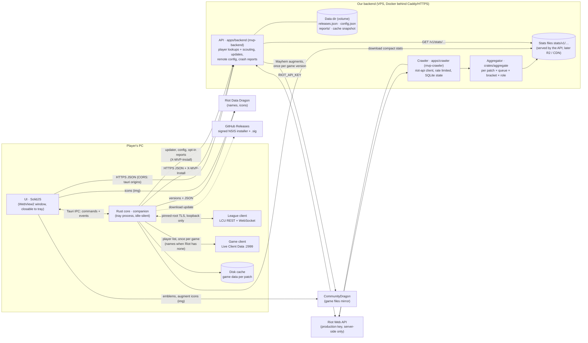

# Architecture



## Principles
- **The core owns data, the UI renders it.** Every UI-facing type lives in `crates/domain` and is
  exported to TypeScript; the UI reaches the core only through `ui/src/data/transport.ts`
  (Tauri IPC in the app, scripted mock scenarios in a browser, HTTP later for a web version).
  The mock only ships in browser builds (`pnpm dev`, `build:preview` for the UI tests, into
  `ui/dist-preview`); the desktop build (`pnpm build` = `vite build --mode app`, into `ui/dist`,
  the one the bundle budgets measure) leaves it out with the widget harness. Both builds shrink
  the same code (`ui/vite.config.ts`): short CSS module class names, lazy views' preload lists
  without the startup files, constant classes set once (Solid's `@once`, written at build time).
- **Light next to League.** No overlay, no injection, no polling loops in the UI; the webview can
  be closed while the core keeps following the client from the tray. Budgets and an idle-work
  test guard this in CI, plus a real-app memory/CPU check on Windows.
- **Privacy and policy by construction.** Hidden players' identities are never deserialized from
  the champ-select session. The Riot API key only exists on our server. See `policy.md`.
- **Stats are transparent.** The draft model (`crates/stats/src/draft`) is additive log-odds with
  empirical-Bayes shrinkage: every number comes with its games, weight and uncertainty.

## Backend API (`apps/backend`)
The only holder of the Riot API key. JSON, camelCase, types from `crates/domain` (so the UI gets
TypeScript types); failures answer `ApiError` `{ error, message, retryAfter? }`.

| Route | Answer |
| --- | --- |
| `GET /health` | `Health` `{ ok, version, riotKey }` |
| `GET /v1/players/{platform}/{gameName}/{tagLine}` | `PlayerProfile` · 400 bad platform · 404 · 429 + `retryAfter` · 503 without key |
| `POST /v1/players/batch` `{ platform, players: RiotId[] }` (≤ 10; older apps: `puuids`) | `ScoutCard[]` for loading-screen scouting |
| `GET /v1/live/{platform}/{gameName}/{tagLine}?gameId=` | `ActiveGame`: the game that player is in as Riot shows it (Spectator-V5: streamer-mode players anonymous), with the visible players' cards · 404 `notFound` / `filtered` |
| `GET /v1/matches/{platform}/{matchId}` | `MatchDetails` (both teams, every player's grade) from the match cache · 400 bad platform or id · 404 |
| `GET /v1/stats/index` | `StatsIndex` (published patches, `current`) · ETag, `max-age=300` |
| `GET /v1/stats/{patch}/{queue}/{file…}` | published stats files (below) · ETag/304, `max-age=3600` · 404 when absent |
| `GET /v1/updates/{target}/{arch}/{version}?channel=` | 204 or the Tauri updater manifest (staged rollout, channels, blocked releases) |
| `GET /v1/config?version=&channel=` | `RemoteConfig` (feature flags, kill switches, min version, banners) · `ETag`/304 |
| `POST /v1/reports` | opt-in `CrashReport`, scrubbed of personal data, kept 30 days |
| `GET /v1/mayhem/tiers` | `MayhemTiers`: the owner's augment tiers (`mayhem-tiers.json`; empty without it) · ETag, `no-cache` |
| `GET /v1/mayhem/augments` | `AugmentCatalog`: ARAM: Mayhem's augments, English and French · ETag, `max-age=3600` · 404 until built |
| `POST /v1/mayhem/games` | opt-in `MayhemUpload` → `MayhemUploadAnswer` `{ accepted, duplicates }` · 400 · 413 over 64 KB · 429 |
| `GET /v1/mayhem/stats?patch=` | `MayhemStats`: pick counts of a patch's shared games (default: the newest) · ETag, `max-age=300` · 404 without games |
| `GET /metrics` | Prometheus text (admin address or bearer token) |

Scouting batches name players by **Riot ID**: the League client's PUUIDs are not our API key's
(Riot encrypts PUUIDs per key), so the server resolves each Riot ID with account-v1 (cached a
day) and builds the card from our key's PUUID. Cards carry the account's Riot ID next to that
PUUID and positive/neutral tags only (OTP, main role, hot streak, veteran); players nobody
knows get no card. Live games (`/v1/live`, Spectator-V5) are asked with the local player's own
Riot ID and kept an hour under each visible player's PUUID, never served for another `gameId`:
everyone else in that game costs no Riot call, and the accounts Riot showed go to the account
cache for the batch that may follow; cards not built within 5 s are left to that batch
(`cardsComplete: false`) while their lookups carry on. Caches in memory with request
coalescing: profiles and cards 2 min,
accounts 1 day, compacted match documents forever (LRU-bounded: the 28 participant fields the
profile, the grade and match details read, keystone and rune trees only, kept as JSON text);
accounts and matches are snapshotted to the data dir on shutdown (snapshot format 2: an older
snapshot is ignored, its matches lack what grades need). Lookups share one rate limiter per
routing value; a 429 is reported to the caller rather than waited out when Riot asks for more
than 5 s.

Platform services (`apps/backend/src/ops.rs` and siblings) sit next to the Riot routes:
- **Updates:** releases are described in `releases.json` (edited by `mvp-backend release
  add|promote|block`), served in the Tauri v2 updater format. Staged rollouts bucket installs
  by `SHA-256(install id, version)`, so an install's answer is stable; beta follows stable too;
  blocked releases are never offered and never downgraded from (the fix is forced instead).
  The release workflow signs the installer (`createUpdaterArtifacts`, key in CI secrets).
- **Remote config:** `config.json`, validated at load and re-read when its mtime changes (no
  watcher, no polling); the app applies kill switches immediately.
- **Reports:** opt-in only, scrubbed (Riot IDs, PUUIDs, user names in paths, e-mails,
  credentials, IPs), per-install rate limited, daily JSONL files pruned after 30 days,
  erasable per install id (`mvp-backend reports forget`).
- **ARAM: Mayhem:** the owner's tiers file (validated, reloaded on change), the augment catalog
  built from the game's files, opt-in shared games counted into pick rates. Below, "ARAM: Mayhem".
- **Hardening:** every request gets an id, a span and metrics; `/v1/*` is rate limited per
  `X-MVP-Install` (else IP) with 429 + `Retry-After`; body limits and a 45 s timeout; JSON logs
  in production; graceful shutdown.

Run, deploy, data dir layout and privacy: `apps/backend/README.md`.

## League client status (`lcu::connector`, `ClientStatus`)
`connection` is `notRunning` (no lockfile), `connecting` (handshake), `connected` (REST answers,
events subscribed) or `notAnswering`: the event socket is up but requests get no answer (seen on
a real client whose every connection another app held; the WebSocket stayed up and MVP said
"connected" while each request failed). Every `LcuClient` request reports whether it got an
answer (any HTTP status is one); a transport failure anywhere in the core flips the state to
`notAnswering` (the phase stays: events still flow), the next answer flips it back. While it
lasts, one cheap `GET /lol-gameflow/v1/gameflow-phase` asks again after the poll interval (2 s),
then twice as long each time up to 30 s; nothing is polled while the client answers. UI: the
title bar says "League client not responding" with an amber dot; Home's profile error says the
client isn't answering and MVP retries (`current_profile` rejects with `ClientError`
`notAnswering`, never the request's URL), and the profile reloads by itself once the status turns
`connected` again. Mock: `MockLcu::stop_answering`/`answer_again`, scenario `client-not-answering`.

## Backend client (`companion::backend`)
The app reaches the backend **from the core**, never from the webview: the UI calls Tauri commands
(`search_player`, `live_game`, `retry_scouting`, the stats commands below) and the core makes the
HTTPS request.
- **Base URL**: `MVP_BACKEND_URL` at **build time** (`MVP_BACKEND_URL=https://api… pnpm build:exe`);
  without it, `http://127.0.0.1:8787` (a local `pnpm backend`). **Debug builds** also read
  `MVP_BACKEND_URL` at run time, to point a dev app anywhere without rebuilding:
  `MVP_BACKEND_URL=http://127.0.0.1:8787 pnpm app`. The CSP's `connect-src` lists the local origin;
  add the production origin there once it exists (only needed if the webview ever calls it directly).
- **Install id**: a random 128-bit hex id in `install-id` next to `settings.json`, sent as
  `X-MVP-Install` on every request, the update check included (anonymous; lets the server
  rate-limit per install, stage rollouts and erase an install's crash reports). Settings shows it
  next to the crash-reports switch (`app_info.installId`) for deletion requests.
- **Timeouts**: connect 5 s, lookups 20 s, scouting batches 35 s (the server gives up at 30 s).
- **Errors** map to `domain::BackendError` (`notFound`, `rateLimited { retryAfter }`,
  `unavailable { message }`, `network { message }`); commands reject with it and the UI words it.

## Remote config, app updates and crash reports (app side)
All three run in the core, so they work with the window closed; the UI only shows them.
- **Remote config** (`companion::remote::RemoteConfigStore`): `GET /v1/config?version=&channel=stable`
  at start, then again after each answer's `pollAfterSecs` (one tokio timer in the core, 10 min
  after a failure), revalidated with `If-None-Match`. The last answer is kept in
  `remote-config.json` next to the settings and applies from the next start, before (or without)
  the network: a kill switch stays on while offline. A copy fetched for an older app version gets
  its `updateRequired` recomputed. The core applies it as it changes (`companion::Services.remote`):
  the `autoAccept` kill switch or feature flag stops a pending accept at once and wins over the
  player's setting; `scouting: false` skips the batch (the teams still show); `playerSearch:
  false` makes `search_player` answer `unavailable`; `draftHelper: false` publishes the draft
  without the helper's numbers (teams only); each import part stops when its flag is off or its
  kill switch on (`remote::import_allowed`: skipped as `paused`, never tried on lock-in). UI:
  `remote_config` + `remote-config`.
- **App updates** (`companion::updates::UpdatePlan`, pure and unit-tested; carried out by
  `apps/desktop/src/updater.rs` with tauri-plugin-updater): first check 30 s after start, then every
  6 h, at once when the config says `updateRequired`, or when the player asks (`check_for_updates`).
  Endpoint `{backend}/v1/updates/{{target}}/{{arch}}/{{current_version}}?channel=stable` with
  `X-MVP-Install`; `mandatory` is read from the manifest. **Never during a game**: nothing downloads
  or installs in ready check, champ select, loading or in game; a running download stops when one
  starts and resumes after. A downloaded update (verified with the public key) waits: the player
  restarts into it ("Update ready — Restart", `install_update`; the NSIS installer runs passive and
  reopens MVP), otherwise it installs when MVP quits (tray Quit, or closing without *close to
  tray*), without reopening it. The public key is `plugins.updater.pubkey` in
  `apps/desktop/tauri.conf.json` (empty until the key pair exists; how to make it: backend README,
  App updates). Debug builds, builds without that key and plain-HTTP backends report
  `unavailable` and never check. UI: `update_status` + `app-update` (`domain::UpdateStatus`).
- **Crash reports** (`companion::crash`, opt-in: `Settings.crashReports`, off by default): a panic
  hook writes a report to `crash-reports/` next to the settings (release builds abort right after;
  it goes out at the next start) or sends it at once when the app survives; the UI forwards its
  crashes (uncaught errors, rejections, crashed widgets, not expected failures) with `report_error`,
  and only while the setting is on (the core checks again). Reports are scrubbed before they
  leave (`crates/scrub`, the server's own rules), bounded to the server's limits, at most 10
  waiting and 5 sent per start; refused ones are dropped, rate-limited ones kept. Turning reports
  off deletes what waits. A report holds the error, the app and OS/webview versions and the
  install id, nothing about the Riot account.
- **UI** (`ui/src/app/Banners.tsx`, loaded lazily, and `app/notices/`): active banners at the top of
  the page frame (English text for now; `dismissible` ones close and stay closed by id in
  `localStorage`), the update prompt (hidden during a game, "Later" until the next launch), and,
  below the minimum version, a blocking-but-polite card over everything under the title bar with
  `minVersion.message` and the one action that fits (restart, check again, wait for the game to
  end). Links open in the browser through the core (`open_banner_link` takes a banner id, never a
  URL). Settings → About shows the update status with "Check for updates" / "Restart to update".

## Loading-screen scouting (`companion::live`)
When the phase reaches Loading or InGame the core reads `GET /lol-gameflow/v1/session` once per
game (both teams: champion, position, the client's PUUIDs; spells from
`playerChampionSelections`) and publishes a `LiveGame` (our team first). The session names
nobody but the local player (2026-09: no `gameName`/`tagLine`, bots not listed in custom
games; the local player's Riot ID comes from `current-summoner`), so `LiveGame.names` says
where the others' names are, and the core fills them in, publishing each step (`live` event):
1. **Riot's live game** (`names: asking`): `GET /v1/live/{platform}/{me}?gameId=` with the
   local player's own Riot ID, asked once more after 8 s if Riot doesn't list the game yet
   (`LiveConfig.riot_retry`). The answer names every visible player, keeps streamer-mode ones
   anonymous, marks bots, and brings the visible players' cards.
2. **The game itself** (`names: waiting { filtered }`) when Riot has none (no backend, not
   listed, `filtered` for Ranked Flex and Arena, an error): `companion::live::GameClient` reads
   `GET https://127.0.0.1:2999/liveclientdata/allgamedata` (the League client's root; debug
   builds: `SCOUT_GAME_CLIENT`) every 2 s (every 10 s after 90 s) until it lists the players,
   which it does once the loading screen is over (≈ 23 s after `InProgress` on the real
   client), then never again. The task is aborted with the game, so nothing asks outside one.
   Meanwhile the local player's own card is asked for at once (it needs no one else's name).
   Players it can't name reliably (streamer mode: a missing or partial Riot ID, a champion's
   name, a name shared by several players) are hidden; champions and spells are read from
   their Data Dragon keys (`rawChampionName`, `rawDisplayName`) through `GameIds` (the loaded
   game data).
Both lists are matched to seats by side (where the list names the local player, else the way
round more champions match, else the session's first team is blue) then champion, a champion
twice on one side in order (`live::seats`); players the session didn't list (bots) get seats of
their own; a seat already hidden stays hidden and the local player keeps their own name. Then
`POST /v1/players/batch` asks **by Riot ID** for the cards still missing (none when Riot's
answer brought them all) and fills them in place, matching each card back to its seat by Riot
ID (case-insensitive: the server answers with the account's own spelling). The client's PUUIDs
stay in the core (they identify the local player and pair spells): our backend's API key can't
read them. Champion select is never read for identities. The game ending clears the view; a
failed batch is shown in the page head with a retry (`retry_scouting`: names already in are
kept, only the cards are asked again). The remote config's `scouting` flag turns our server's
lookups off (Riot's live game and the cards): the names still come from the game, without
cards. UI: the page head says where the names are in a slot that is always there (so the head
never wraps and the teams never move when the line changes): `Looking players up…`, or that
the names come after the loading screen, plainly saying when Riot doesn't share the queue. Seats
show a name placeholder until theirs arrives, pulsing while it is asked for and still while the
game hasn't loaded (a minute or two); bots read "AI bot" with their champion, streamer-mode
players "Hidden player" with their lane; a visible player's Riot ID links to their player page
(`#/player/{platform}/{gameName}/{tagLine}`, as the search opens it).

## Match insights (`stats::grade`, `companion::matches`, `ui/src/views/home`)
Every finished game in a match history gets a grade, and a match row opens on the whole game.
- **The grade** (`crates/stats/src/grade.rs`, pure and property-tested; its doc has the formula)
  rates one player's game against the other nine: kill participation, KDA (against the other
  nine's), shares of the team's damage, damage taken (+ mitigated), damage to objectives and vision
  score (each against the role's typical share), CS and gold per minute against the lane opponent.
  Each part is scaled to [−1, 1], weighted by role, and `5 + 5 ×` their weighted mean is the score
  (0–10, 5 is an even game for the role; a part the game doesn't have, like a lane opponent in
  ARAM, leaves the mean). Letters: **S+** ≥ 8.5, **S** ≥ 7.5, **A** ≥ 6, **B** ≥ 4, **C** below.
  Place 1–10 by score (ties: takedowns, then damage); **MVP** is the best of the winning team,
  **ACE** the best of the losing team. The two or three parts that moved it most travel with it
  (`GradeFactor`: kind, the scoreboard fact, points): the "why" the UI shows. No grade for remakes
  (≤ 300 s) or games that aren't two teams of five with one winner. References and cut-offs are
  first estimates, to calibrate on crawled games (each role should average 5).

  | Role | Kill part. | KDA | Damage | Taken | Objectives | Vision | CS | Gold |
  | --- | --- | --- | --- | --- | --- | --- | --- | --- |
  | Top | .15 | .20 | .20 | .10 | .10 | .05 | .10 | .10 |
  | Jungle | .20 | .20 | .15 | .10 | .15 | .10 | .05 | .05 |
  | Mid | .15 | .20 | .25 | — | .05 | .05 | .15 | .15 |
  | Bot | .15 | .20 | .25 | — | .10 | .05 | .15 | .10 |
  | Support | .25 | .20 | .10 | .10 | — | .30 | — | .05 |
  | none (ARAM) | .25 | .25 | .30 | .15 | .05 | — | — | — |
- **Computed where the whole game is known**, sent as `MatchSummary.grade`. Other players' games:
  the backend grades the Match-V5 documents the profile already reads (`players::grade_of`). Your
  games: the client's match list holds only you, so the core reads each gradable listed game once
  from `GET /lol-match-history/v1/games/{gameId}` (4 at a time, the last 100 kept) *after* the
  profile answered: the match list asks `match_grades { matchIds }` for its rows without one and
  the core answers from its cache or reads what's missing; the next `current_profile` fills them
  from the cache. A game the client doesn't return is asked again later, never a finished game
  twice.
- **Roles of your games** (`companion::matches::roles`): the client's `timeline.lane/role` is
  Riot's legacy guess (real games: a mid Kennen called TOP, an Ezreal "in the jungle" without
  Smite, a roaming support called MIDDLE), and a wrong role grades against another role's
  references. Each Summoner's Rift team gets one of each role: the most likely of all 120
  assignments, the product per player of the champion's role share (the published ranked
  `champions.json`, Emerald+, of the index at hand — nothing is requested just for roles — each
  champion's games shrunk toward a built-in prior of usual roles with 50 pseudo-games; the prior
  alone without stats, equal shares for a champion it doesn't know, 1 % floor), the client's
  lane as weak evidence (×3 the lane it names, ×2 the jungle and both bottom roles, ×1.5 the
  bottom role it names), lane minions and monsters per minute (laners ≥ 4, supports ≤ 2.5,
  junglers ≥ 3 monsters; ×e⁻¹ per one short or over) and a support item (×20). Smite is a rule:
  with Smite on the team the jungler holds it. Howling Abyss has no roles. The match list's rows
  guess from your line alone (`profile::listed_role`) until the whole game is read: then
  `match_grades` answers each game's role with its grade (`GradedMatch.role`) and the next
  `current_profile` carries it, so the rows, "Main role" and the roles bar agree with the grades.
- **Match details**: `match_details { matchId }` → `MatchDetails`: both teams (blue first, lanes
  in order), each player's Riot ID (none when hidden: `nameVisibilityType: HIDDEN` in the client,
  no name in Match-V5), champion and level, role, K/D/A, CS, gold, damage to champions, vision
  (no column on Howling Abyss — ARAM, ARAM: Mayhem… `lib/queues.ts` — or whenever everyone's is
  0), items and trinket, spells, keystone and secondary tree, grade, `isMe`. Your listed games come
  from the client (the same read as their grades, cached); any other game from
  `GET /v1/matches/{platform}/{matchId}` (the backend's match cache); failures aren't cached.
- **UI**: a match row is a button (`aria-expanded`) with the grade chip (`GradeChip`, the tier
  list's grade colours) over the place or MVP/ACE. Click, Enter or Space opens the game under it,
  one at a time; a second click or Escape closes it and gives the focus back; when a game above
  closes, the page scrolls so the clicked row stays put. The game's code rides in the player
  page's chunk (`provideDetails` in App.tsx: a chunk of its own would split the chunks it shares
  with the first screen), loaded on first use with the views' words; meanwhile a skeleton of the
  table's exact height (540 px, fixed line heights). Hovering a grade, or focusing its row from
  the keyboard, shows its why: the app's tooltip ("Tooltips" below) anchored to the chip, gone on
  leave, Escape or a click. The page owner's line is marked.
  Grades never show in Draft or on the Live cards. Mock: `data/mock/match-fixtures.ts` (a seeded
  whole game per row, graded by a TS port of the formula), scenarios `match-details-slow`,
  `match-details-error`, `match-details-gone` and `extreme`; `mock-lcu` serves whole games
  (`mock_lcu::history`, one player in streamer mode).

## After a game and over time (`companion::post_game`, `companion::lp`, `ui/src/views/home`)
Home sums up the game that just ended, shows the LP each ranked game was worth, pages further back
through the history with filters, and shows your mastery. Your own data only, from your client.
- **Following a game** (`post_game::PostGames`, fed by the core's loop): when a game loads
  (Loading/InGame) the core reads the gameflow session once for the game id and queue and, in
  ranked solo/duo (420) and flex (440), the standing before it
  (`/lol-ranked/v1/current-ranked-stats`, kept as `pending` on disk so a restart mid-game still
  counts it). When the phase leaves the game, a task reads the whole game
  (`/lol-match-history/v1/games/{id}`, the read that grades it, kept by `MatchInsights`: the list
  then shows its grade and it opens at once) and the standing again until the client has counted
  the game (its wins + losses one more): at once, when the client's ranked-stats event arrives
  (the connector subscribes to it), else after 2, 3, 5, 8, 13, 20, 30 and 45 s; then nothing until
  the next game. A remake has no LP to wait for; a standing counted twice, or unranked on one side,
  leaves the LP unknown (never guessed).
- **`PostGame`** (`post_game` command, `post-game` event): result, your line (grade with its
  facts), your lane opponent (your role on the other team; without roles, as in ARAM, the enemy
  whose share of their team's damage is closest to yours; none when not exactly one), the LP once
  counted (`lpPending` meanwhile). Hidden when the player closes it (`dismiss_post_game`: never
  shown again) or at the next champion select or game.
- **LP** (`lp::LpStore`, `lp_history`): `LpGame { gameId, queue, at, before, after, delta,
  ladder }` newest first, at most 100 per queue, in `lp-history.json` in the app's data folder
  (atomic writes; an unreadable file is set aside). `delta` is the difference of the two
  standings on one ladder: 100 LP per division, a tier 400, the apex tiers (Master up) plain LP
  from 2800 (Master 0 LP = Diamond I 100 LP), so promotions and demotions count across divisions;
  `ladder` is the standing after, for graphs. Two standings the player saw: no MMR, no estimate.
- **Older games** (`older_matches { begIndex }`): the client's list from `begIndex` to
  `begIndex + 19` (both ends inclusive: 0–19 is 20 games), graded and opened like the first page
  (`MatchInsights::older` adds them to the listed games). A shorter page is the history's end.
- **Mastery** (`champion_mastery`): `/lol-champion-mastery/v1/local-player/champion-mastery` (read
  for the draft helper already), most points first, ten at most. The backend doesn't expose
  mastery: player pages show none.
- **UI**: the post-game card tops Home (`PostGame.tsx`, lazy: it rides in the player page's chunk
  with an opened game's code, loaded only when there is a game to sum up; `<Widget name="post-game">`);
  the autopilot already brings the window Home after a game, and never away from a page the
  player opened. The opponent's name links to their page unless hidden. Match rows carry `+19 LP`
  / `−17 LP` (`RecentMatches` `lp`). `MatchHistory.tsx` filters by queue (All / Solo / Flex /
  ARAM with Clash and Mayhem / Other) and champion among the games loaded (links can set them:
  `#/?queue=flex&champion=103`), and loads older games (Home only); rows shown ask for their
  grades, each once per list the core sent (no flash while filtering). The ranked pane draws the
  solo/duo LP over the tracked games (`LpTrend`, one ladder), the champions card your top five
  masteries. Mock: `data/mock/progress-fixtures.ts`, scenarios `post-game`, `post-game-demotion`,
  `post-game-lp-unknown`, `post-game-lp-pending`, `post-game-aram`, `history-long`,
  `history-more-slow`, `history-more-error`; `mock-lcu` pages its list and ends each cycle's game
  in the history, the standing counting it a moment later.

## Tooltips (`ui/src/design/tip`, `static_data::descriptions`)
Every hover explains what it is in a designed card, never the system's plain `title` box (a test
checks no view has one). Runes, stat shards, summoner spells and items say what they do, in the
UI's language, wherever their icons show: champion pages (and Live's *My build*, the same cards),
match rows, opened games, Live's cards. Everything else gets a compact card:
- **`data-hint="…"`** (lines split on `\n`, a heading in `data-hint-title`): the words the
  component already computes, e.g. a build option's `812 wins in 1,530 games` and pick count in
  one card, a matchup row's record and what its effect means, a disabled import button's reason,
  a tier-list column's definition, the grade column's formula, a cut name in full.
- **Ideas the app explains** (`data-tip="tier:S"`, `nav:draft`, `status:connected`): a tier's
  meaning, what each page of the rail holds, what the client's status means for MVP; their words
  are in the lazy catalogue (`t().tip`), so first-screen components only carry the short key.
- **Keyboard**: a hint shows when its element, or a control inside it (a tier-list column's sort
  button, a matchup's link), gets the keyboard focus. Explanations of numbers and definitions are
  focusable (`tabindex="0"`, with a reasoned lint suppression); hints that only restore a cut
  label (names) or name what a column already says (an opened game's level and damage), and
  those inside another control (a suggestion's mastery line), are hover-only: an opened game
  would otherwise double its tab stops.
  An icon button's hint that repeats its `aria-label` isn't read twice (no `aria-describedby`).
- **Hover intent**: a card shows after 200 ms of hovering, at once when another one showed
  within 400 ms (the pointer moves along a list), and immediately on keyboard focus.
- Things covered by a stretched link (a tier-list row) lift their badge over it; a click on the
  badge still opens the row.
- **Texts from the core, when asked**: `game_description { kind, id }` → `Description`, in the
  loaded `GameData`'s patch and language (so it reads like the names beside it); never with the
  names (`GameData` no longer carries the runes' short texts). Data Dragon's own texts, read from
  the patch's cached files: runes' `longDesc` (their `shortDesc` when the long one has values only
  the game fills in, `@f1@`), spells' `description` and `cooldownBurn`, items' `description`
  (their `plaintext` when it shows nothing). Stat shards aren't in Data Dragon: their names and
  effects come from the League client's `perks.json` as `CommunityDragon` mirrors it (the patch's
  folder, else `latest`), downloaded the first time a shard is described and kept as
  `shards.json` beside the patch's files; the core keeps them for the session (`ShardTexts`: a
  failed download isn't tried again before a restart) and the UI falls back to its own words
  (`t().shards`). Items, runes and spells are read from disk per request (one file, a few ms, off
  the async threads): nothing stays in memory.
- **Riot's markup never reaches the page**: `static_data::rich_text` turns it into lines of text
  spans, each with a tone (`strong`: stats' values, passives' and actives' names; `subtle`: rules
  and flavour; `physical`, `magic`, `true`, `heal`: the game's colours); every tag is dropped,
  entities decoded, whitespace collapsed, an empty line between paragraphs, `<li>` bulleted. The
  UI only writes text nodes. The browser mock has a port (`data/mock/descriptions.ts`); both are
  held to the cases in `fixtures/rich-text-cases.json` (cargo test and vitest).
- **One tooltip layer** (`design/tip/Tip.tsx`), the grade's why included: a `popover="auto"` in
  the top layer (no card clips it), anchored in CSS (`anchor-name` on the element, `position-area:
  bottom`, flipping above near the window's bottom, sliding along the edge to stay 8 px inside,
  hidden with its anchor), `aria-describedby` on what it explains; gone on leave, when the focus
  moves on, on Escape (only the tooltip: an opened game under it stays) or a click. It is drawn in
  `#root` beside the shell, not under the backdrop's panes (no backdrop render).
- **The card** (owner, 2026-09-28): the thing's icon, its name (an item's cost beside it) and what
  it is (*Keystone · Domination*, *Summoner spell · 300 s cooldown*, *Stat shard · Offense*), then
  its full text; behind it the thing's own picture, much larger, blurred and dimmed, fading out
  before the text (a shard: a glow in its stat's colour, `--shard-tone`); glass like the app's
  drops (`.glass-drop`: an even tint, a sheen over the upper half, a rim lit along the top).
- **At rest it costs nothing**: icons only carry `data-tip="item:3031"` (a shard adds its row:
  `shard:5008:offense`) and a `tabindex` where they aren't inside another control (a match row
  keeps one tab stop; unchosen runes and shards are hover-only). One set of document listeners
  (`follow.ts`, startup) forwards pointer and focus events once one reached a `data-tip` or
  `data-hint` element; the tooltip's code rides in the player page's chunk (like an opened
  game's) and loads then, with the views' words. A text is asked once per thing and game data;
  the card waits for it within the hover's 200 ms (the core answers in a few ms), else shows and
  fills in.
- Mock: the dev cache (Data Dragon's files, and CommunityDragon's perks for the fixtures' patch:
  `scripts/fetch-dev-assets.mjs`), read like the core does; scenarios `descriptions-missing` and
  `descriptions-slow`; the cards side by side: `#/__harness?show=game-tips`.

## Search (title bar)
Champions match locally and instantly (fuzzy: prefix, word, initials, subsequence); a Riot ID
(`Name#TAG`) adds a player row that is looked up in the background (debounced 300 ms) and fills in
place. The rows are a pure function of the typed text, so Enter always opens what is highlighted
when it is pressed. Lookups are shared with the player page (2 min in memory, failures not cached).
Recent searches (max 8) and the region live in `localStorage`.

## Stats pages (`ui/src/views/tierlist`, `ui/src/views/champions`)
The Tier list and Champions pages read the published stats through the core only (`stats_index`,
`tier_list`, `champion_stats`, event `stats-index`; see `transport.ts`); failures carry a
`BackendError` and read as "nothing published yet" (empty state) or an error with a retry.
- **Scope**: queue (420 ranked solo · 450 ARAM), rank bracket and the tier-list role filter are
  remembered in `localStorage["mvp.stats-filters.v1"]` (`lib/stats-filters.ts`) and shared by both
  pages. Links can set them: `#/tier-list?queue=450&role=middle`; on a champion page `role` picks the
  role tab instead (`#/champions?id=103&role=middle`), falling back to the champion's main role.
  The bracket starts from the settings' `statsBracket` (`lib/settings.ts`, set by the shell from
  `get_settings` and the `settings` event); one picked on the pages is saved with the setting it
  was picked over (`over`) and holds until that setting changes, which brings the pages to it.
- **Requests**: `lib/query.ts` keeps the last answer on screen while a newer one runs (switching a
  filter never blanks the page), drops answers to older keys and never triggers the app's
  Suspense. The `stats-index` event bumps a version in every request key: pages refetch when a new
  publication lands. No timers, no polling.
- **Tier list**: rows ranked by score within the role shown (a divider opens each tier), sortable
  columns (`aria-sort`), 50 rows then "Show all" (keeps the DOM small), each row a link to the
  champion in that role; win rate is the shrunk one with its games, a footnote explains score and
  grades.
- **Champion page**: hero (art, role tabs with their share of the champion's games, tier, win/pick/ban
  rates with their counts, patch), then for the chosen role: the full rune page (both trees, the
  chosen runes lit in the tree's color, shards; the next most played pages one click away), spells,
  skill max order and first points (keycaps), items (starting, core in order, boots, 4th/5th/6th),
  every option with win rate, games and pick share; matchups best/worst by the shrunk effect `d`
  (lane, vs jungler, duos; rows open the other champion). ARAM: no roles, no bans, no matchups.
- **Champion list** (`/champions` without an id; `lib/champion-grid.ts`, `views/champions/ChampionGrid.tsx`):
  every champion as a tile (icon, name, and the number it's sorted by). A role shows the champions
  with a tier-list row in it, so one played in two roles is in both (the tier list's role filter,
  shared and remembered); "all" takes each champion's most played role for its tier and adds its
  roles up for its pick rate. Sorted by tier (default), pick rate or name, the choice remembered in
  `localStorage["mvp.champion-sort.v1"]`; by tier, groups read like a tier list (the letter and
  the group's size in a column left of its tiles, sticky while the group scrolls by, champions
  with too few games last) and tiles leave their badge to the heading. The field filters as you
  type (fuzzy, best match first, ungrouped; Enter opens the first; the sort waits, dimmed, until
  the field is empty). Without stats (offline, nothing published) the page still works: one line
  says why ("Try again" ending it when that can help), the role and sort go away and the
  champions are grouped by Data Dragon class. The grid is built a slice at a time
  (`lib/progressive.ts`: 36 tiles with the view, 36 more whenever the page is idle, again from the
  start when a filter changes; `aria-busy` meanwhile; a group shows once some of its tiles are
  built): switching to it doesn't wait for ~170 tiles, the first screen shows at once.
- **Runes** come from `GameData.runes` (Data Dragon `runesReforged.json`, cached with the patch;
  icons under `artBase/img/…`). Stat shards (5001–5013) aren't in Data Dragon: `lib/runes.ts` names
  them and `design/RuneIcon.tsx` draws them as glyphs (no Riot art); their tooltips use the League
  client's own words when the core has them ("Tooltips" below).
- **Controls**: `design/Segmented.tsx` is the radio group used for every filter and tab (one tab
  stop, arrow keys, Home/End; the selection is a separate thumb element). Not every choice should
  look like a pill: the champion list's sort is the same group restyled as words with a gliding
  accent bar (`.sortTabs` in `Champions.module.css`).
- **For later**: `views/champions/BuildSummary.tsx` (keystone + secondary tree, spells, max order,
  core items) is ready for the Live page (the local player's champion and role, the game's queue);
  an "Import" action (rune page, item set: HANDOFF job 5) belongs in the Runes card header, next to
  the page's numbers. `#/__harness?show=<widget>` shows any registered widget alone (mock builds).

## Settings and automations
- **Settings** (`domain::Settings`) are owned by the core: `companion::settings::SettingsStore` loads
  `settings.json` from the app config dir at start (missing/corrupt → defaults), saves every change
  atomically (temp file + fsync + rename) and publishes it on a watch channel. The UI reads and
  writes them with `get_settings` / `update_settings` and follows the `settings` event. Opt-ins
  (`autoAccept`, `crashReports`) are off by default. `statsBracket` (Emerald+ by default, Diamond+,
  Master+; files saved before it load with the default) is whose games the stats count: the draft
  helper, its compositions and build imports switch to it at once; the stats pages start from it.
- **Automations** run in the core (`companion::automation`), so they work with the window closed:
  auto-accept (opt-in, delayed, once per ready check, see policy.md), the automatic build import
  at the first lock-in (opt-in per part, see "Build imports" below) and the `Autopilot`, which
  turns gameflow phases into window intents: focus in champ select, Draft → Live → Home as the game
  goes. The UI reports every view it shows (`view_changed`), so a page the player opened is never
  switched away from.
- **Shell**: the window is created on demand (launch, tray, champ select); closing it frees the
  webview and, with *close to tray*, the app stays in the tray. A `navigate` event moves the UI; a
  window created for an intent opens directly on its view. *Launch at startup* uses
  tauri-plugin-autostart and starts in the tray (`--autostart`).
- **Search** (the Settings page's field; `views/settings/search.ts`, pure and unit-tested): every
  word typed must be found in a setting (its card's title counts for all its rows), folded like
  the title bar's champion search (`lib/fuzzy`: case, accents, punctuation). Best is as typed at
  a word's start (words run together too, "autoaccept"; plurals find the singular); only when a
  word is found nowhere so do matches inside a word, left-out letters (`matchScore`) and one typo
  (two from 8 letters) count. Words of one or two letters count only alone. Besides the words on
  screen, a setting is found by what players call it (`settings.search.keywords`, per language)
  and its control's labels (Emerald+, Light, Open log folder). A setting and the ones nested under
  it show together; About's sections are its rows; only About found takes the settings' column.
  The page hides what isn't found (cards stay mounted: nothing resets) and marks what is
  (`design/Marked`); nothing found says so, with Clear search. Ctrl+F focuses the field on this
  page only (Ctrl+K stays the title bar's), Escape empties it then leaves it; the query lives
  with the page. No timers: it all runs on input.

## Languages (`ui/src/i18n`)
English and French, for every word the player reads (views, states, toasts, tooltips,
`aria-label`s). Riot's own names (champions, items, spells, runes) and what they do (tooltips)
come from Data Dragon in the same language (stat shards: the League client's own words).
- **Catalogues**: `en.ts` + `en-views.ts` are the source, nested objects of strings and small
  functions for anything carrying a value (plurals, agreement, French elision `d’Ahri`), always
  whole sentences. `fr.ts` + `fr-views.ts` have exactly their shapes (`satisfies`): a missing or
  extra key fails the typecheck. `catalogue.test.ts` walks both (same keys, same arities, every
  function called with samples, no empty text, French only equal to English for a listed set of
  shared terms such as ARAM, Draft or KDA, French typography: a no-break space before `: ; ! ? %`
  and inside « », ’, …).
- **Reading**: components read `t().section.key`, a signal: switching the language re-renders the
  text in place, no reload. Setting the same language again keeps the same words object (every
  `settings` event re-sends it), so nothing re-renders.
- **Loading**: the first screen's words (shell, title bar search, Home) are in the startup
  bundle, in English; the other views' words load with the first of those views (their lazy
  loaders await `loadViewWords`, and Draft and Live preload at startup); French loads only when
  it is on (a few KB each, before the first frame when it is the saved language).
- **Setting**: `Settings.language` (`auto` | `en` | `fr`, default `auto`), kept by the core like
  `effects`, with a local copy in `localStorage["mvp.language"]` so the first frame is in it.
  `auto` follows the webview's language (`navigator.language`, the system's): French when it
  starts with `fr`. Settings → App → Language: Auto / English / Français, each in its own words.
- **Formatting** (`lib/format.ts`, `lib/days.ts`, with `Intl`): English as before (`54.6%`,
  `3,244`, `127K`, `5m ago`, `12 Sep`); French `54,6 %`, `3 244`, `127 k`, `1,9 M de parties`,
  `il y a 3 h`, `hier`, `12 sept.` (a number and its unit never part at a line end). Durations
  stay `29:02`. CSS values are never formatted.
- **Game data**: `game_data { language }` is asked in the UI's language (`auto` resolved there);
  the core loads Data Dragon in `en_US` or `fr_FR` (the disk cache keeps each locale under its
  patch), emits `game-data` again when another language is asked for, and falls back to English
  names offline before a language's first download. The browser mock stays English.
- **The core's own words** follow the same answer (`UiLanguage` in `apps/desktop/src/core.rs`,
  set by `game_data`): the tray menu (Ouvrir / Quitter) and the block titles of MVP's item set in
  the League client's shop (`companion::imports::item_sets`). English until the UI says.
- **Server texts**: the remote config's `LocalizedText { en, fr }` (banners, `minVersion`) shows
  in the current language (`localized`), English when the French one is empty.
- **Still English**: errors worded by the core (shown inside a translated sentence), MVP's rune
  page and item set names and the item set's block titles in the League client, the tray menu.
- **Room**: French runs about a fifth longer than English. Where a label is tight, French gets
  its own shorter words (`Solo/Duo` next to a rank, `Taux de ban`) rather than an ellipsis, and
  lines that can grow wrap (the champion hero's stat details go under their label while the hero
  is narrower than 1100 px).
- **Tests**: the `*-fr` Playwright projects (`locale: "fr-FR"`, so `auto` picks French) run
  layout (views × sizes at 400, 820, 1280 and 2560 px), coherence, errors and interactions in French;
  specs read expected words from the `t` fixture (`tests/app.ts`). `pnpm screenshots` also writes
  the main screens in French (`fr-*.png`).

## Glass and light (`ui/src/design/backdrop`, `ui/src/design/liquid`)
Two layers, one budget: **idle means idle** (nothing is scheduled at rest; the perf suite asserts
0 backdrop renders over 3 s and no script, style or layout work), and every moving part runs on
the compositor (transform/opacity, GPU filters).

**Optics** (`liquid/optics.ts`, pure, unit-tested): a glass pane floats above the page (its
`elevation`), seen from above. Its top is flat and curves down to its flat underside across a
bezel (a parabola for panes and drops, a circle for card edges). The view ray
refracts where the surface slopes (Snell's law, index 1.5), crosses the glass, refracts again
leaving the underside and crosses the gap of air to the page, landing further inside: what is
under the rim is pulled inward and squeezed. Most of the visible bend comes from the gap (a
sheet lying on the page bends ~10 px at most; floating 14–20 px up, a pane's rim bends 12–21 px).
The profile matters more than the strength: a squircle (flat, then a vertical edge) puts nearly
all of its bend in the rim's last pixels, 20–28 px between two neighbouring rows at these
heights, which cuts what is behind into bands (the owner saw lines); a parabola spreads it, at
most ~2.5 px from one row to the next (`optics.test.ts` keeps panes under 3). Past a
grazing angle the underside would reflect everything back (total internal reflection): capped so
the rim's last pixel stays finite. The rim reflects more at grazing angles (Fresnel, Schlick).
The curves are sampled into small tables shared by the two layers below, so they bend light alike.

**Liquid glass over the page** (`liquid/liquid.ts` registers elements; `liquid/lens.ts`, loaded
with the first lens, builds filters from `liquid/maps.ts` + `liquid/filter.ts`): floating chrome
and controls bend the real page behind them. Each element gets an SVG filter used as its CSS
`backdrop-filter` (`backdrop-filter: var(--lg-filter, <plain frost>)`): a light frost → the
displacement map → a deeper frost where the glass is thick (`frostCore`) → vibrancy (saturate,
brightness; inside the filter: Chromium drops a `url()` backdrop filter chained with CSS filter
functions) → the glass' tint → rim light.
- **The map** (nine slices: four corners, four one-pixel edges stretched along, a flood for the
  middle; cached data-URL images at the screen's density, up to 2×, so the bend is as precise as
  the pixels) holds the pull in red/green and, in blue, how much tint the glass shows: none at the
  rim, easing in across the bezel, so the band where the light bends stays clear.
- **Frosted core** (`frostCore`): the map's blue weights a strong blur of the page, so the rim
  (thickness 0) stays sharp and visibly bent while the middle, where labels sit, is calm.
  Nothing bends there anyway, so it costs no optics: bent at the edges, legible in the middle,
  like iOS glass.
- **Tint**: declared once in the element's CSS (`--lg-tint: <token>` with
  `background: var(--lg-fill, <token>)`); while the lens runs, liquid.ts sets `--lg-fill:
  transparent` and the filter paints that tint scaled by blue. Text-heavy panes (search, toasts)
  keep a frosted middle for reading; `--bg-clear` panes over art let the art through. The middle's
  frost and the tint follow the thickness eased by a gamma (`THICKNESS_EASE` 2.2): a steep rim is
  almost full thickness a few pixels in, and taken as is the glass would turn frosted and dark at
  once. Every rim keeps a 1 px pre-blur (0.5 on clear panes): the band right at the rim mirrors
  what is behind it, and razor-sharp it shows text upside down, which reads as a bug.
- **Rim light** comes from the same map: red/green are the outward normal scaled by steepness,
  so a colour matrix gives `normal · light` (light from the top left, a third of it on the far
  rim), sharpened with a gamma, cut to the rim zone (× 1 − thickness: none where the glass is
  full thickness, or its last few percent drew the map slices' edges as lines) and added on top.
  The CSS `glass-rim` ring stays as the crisp edge.
- The optical outline rounds corners at least as much as the bezel is wide (smooth normals, no
  crease along the corner diagonal); a drop is a stadium.
- Kinds (`LIQUID`): `bar` (title bar: a 14 px lower rim bending strongly; content scrolling
  under it stretches along that rim, the rest is lightly frosted, 4 px), `dock` (the rail and the
  floating tab bar: 12 px rims, 6 px frost in the middle), `panel` (search results, toasts: 14 px
  rims, 6 px frost in the middle), `clear` (rank pane and champion tier over art: a wide 20 px bent rim, corners
  `--radius-5` to match, a light frost in the middle for their captions), `lens` (the glass lab's
  drop only). The app's small glass on controls (rail selection, segmented and
  choice thumbs, a held switch's knob) isn't lensed: it is the CSS drop (`design/glass.css`
  `.glass-drop`), an even light tint with a sheen over its upper half and a 1 px inset-shadow rim
  brighter along the top, moving with its control without any backdrop filter. No colour split
  over the page (over text it reads as fringing).
- **Icons and text stay crisp**: a drop always sits *behind* the labels of the rail and of
  segmented controls, gliding or not, and nothing scales while it glides (the rail's move is a
  translate only). A held switch's knob swells into a drop over the track.
- Nothing that carries a lens has an outer box-shadow: Chromium shifts the SVG filter by the
  shadow's reach. Shadows sit on a wrapper; the glass is a layer inside (tested).
- The page scrolls **under** the title bar (`main` spans both rows, padding-top = bar height),
  which bends it along its lower rim. Sticky side columns stick below the bar.
- An element with a backdrop filter hides the page from its descendants' glass (backdrop root),
  so glass is always a layer inside its element, never the element itself.
- Motion (`design/motion.ts`): springs sampled into CSS `linear()` easings (`--ease-spring`, and
  `--ease-glide` critically damped for thumbs that must stay in their track; both kept in sync
  with the code by a unit test). Reduced motion jumps.
- On only with the shader (`data-effects="shader"`); otherwise the same elements keep a plain
  CSS blur (`light`) or none (`off`), and the lens code is never downloaded.
- **Glass lab** (dev server only): `pnpm dev` → `#/__harness?show=glass` shows every kind over
  art, text and straight lines, draggable, to see how each shape bends what is behind it.

**The window backdrop** (`backdrop/`): one WebGL 1 canvas (first child of `[data-ambient-host]`,
fixed, `z-index: -1`, `aria-hidden`, `data-free-style`), drawn **on demand only**.

## Logs and diagnostics (`apps/desktop/src/{logging,diagnostics}.rs`)
- The desktop app logs to stdout (debug builds) and to `mvp.log` in the app's log folder
  (`app_log_dir`: `%LOCALAPPDATA%\gg.mvp.companion\logs`): a release build has no console. The
  previous run's file is kept as `mvp.previous.log`; a run stops writing past 16 MB (one line
  says so). `RUST_LOG` sets the filter (default `info,scout_desktop=debug`).
- Settings → About → "Copy diagnostics" (`diagnostics` command): app, OS and webview versions,
  install id, the League client's state, backend URL, stats patch, game data version and locale,
  emblems on disk, settings, and the log's last 200 lines passed through `scrub` (Riot IDs,
  PUUIDs, IP addresses, user folders). The UI copies it (clipboard API, else a text area and
  `execCommand`). "Open log folder" (`open_logs`) opens the folder in Explorer.

## Ranked emblems (`static_data::emblems`, `ui/src/design/RankEmblem.tsx`)
- **Riot's art, at run time**: at start the desktop core loads the ten tier emblems
  (`RankEmblems::load`): from its cache (`<app cache>/emblems/v1/emblem-<tier>.png`), else from
  `CommunityDragon`'s mirror of the League client files (`…/rcp-fe-lol-static-assets/global/default/
  ranked-emblem/emblem-<tier>.png`; the older `images/ranked-emblem` folder is tried next). The
  client's 16:9 canvases are cropped to the crest (one window for every tier, x 37–63 %, y 30–65 %,
  which keeps the client's hierarchy: higher tiers are bigger) and scaled to 192 × 144 (sharp at
  80 × 60 on a 2× screen), then cached. A tier that fails is left out; offline, the cache serves.
  Bump `CACHE_DIR` to fetch again (new art or another window).
- The UI gets them as data URLs (`rank_emblems` command, `rank-emblems` event when they arrive;
  `ui/src/data/emblems.ts` asks once per session). The app's CSP already allows `data:` images.
- **`RankEmblem`** (`tier | "unranked"`, `sm` 48 × 36 · `md` 64 × 48 (Live cards) · `lg` 80 × 60 ·
  `xl` 96 × 72 (Home; the core's 192 × 144 at 2×)) shows Riot's art when it has it, else MVP's
  crest in the same box (`data-emblem="riot" | "crest"`), so nothing moves when the art arrives.
  The crest: a metal rim around an enamel field in the tier's colour and a cut gem lit from the
  top left, the brightest thing in it (defined once for the page: a hidden SVG with each tier's
  metal and enamel gradients and `#rank-body`); ornaments per tier (crowns, blades, wings,
  horns); a contact shadow, and a glow only from Master up. Colours are mixed from the tier
  tokens (`--rank-<tier>`). No rank: an empty slot, not a dimmed Iron.
- Mock scenarios: none by default (the crest shows), `?scenario=emblems` stands in stylized
  emblems (no Riot art in the repository). Dev lab: `#/__harness?show=emblems` (every tier,
  crest and art, at every size).

## Build imports (`companion::imports`)
MVP writes a champion's build into the League client: its own rune page, its item set for the
champion, the summoner spells (policy: docs/policy.md, "Build imports"). The UI asks with
`import_build { request: ImportRequest { championId, role, queue, bracket, parts, champSelect } }`
and gets an `ImportResult`, one outcome per part: `saved { name }`,
`spellsSet { spellIds, changed, flash }`, `skipped { reason }` or `failed { reason }` (structured;
the UI words them in `ui/src/lib/imports.ts`). The buttons (Runes, Item set, Spells) are always
there, in Draft's import bar and on champion pages. The automatic import sends the same result
as an `import` event (`automatic: true`): a toast anywhere, and the Draft bar's buttons.
- **`champSelect`**: Draft's clicks and the automatic import are for the current champion select;
  if it has ended when the import runs (the core left `ChampSelect`, the session is gone, or its
  timer says `GAME_STARTING`; checked before anything is read, after the build is looked up and
  before each part), every part is `skipped { champSelectEnded }` and nothing is tried. Seen on
  a real client: a click as the game started said "No build for this champion and role".
  Champion pages send `false` (their build is for any game).
- **Builds** come from a `BuildSource` trait: `build(champion, role, queue, bracket) ->
  Option<BuildStats>` (`role: None` = the most played role; queue 420 for every Summoner's Rift
  mode, 450 for ARAM, from the gameflow session's `gameData.queue.mapId` when the request has
  none; other maps have no builds; the request's `bracket`, Emerald+ without one: a champion page
  imports the bracket it shows). The desktop wires the stats client (`StatsClient` implements it:
  the current patch's `builds/{id}.json` of the queue and bracket) into `companion::Services`;
  `imports::build_for_role(&BuildsFile, role)` picks the role's build from a published file.
- **Rune page**: `runes.top[0].ids` = `[primaryStyle, subStyle, 4 + 2 perks, 3 shards]` → a page
  named like `MVP · Ahri Mid` (≤ 25 characters, `ARAM` instead of a role there). MVP's page is the
  first editable page whose name's first word is "MVP" (any case): replaced with
  `PUT /lol-perks/v1/pages/{id}`, its other fields kept. Without one: `POST /lol-perks/v1/pages`
  if the inventory has room (`canAddCustomPage`, else custom pages < `ownedPageCount`), else
  `noFreePage`. Then `PUT /lol-perks/v1/currentpage`. Nothing is ever deleted.
- **Item set**: blocks *Starting items* (with counts), *Core build (in order)*, *Boots*,
  *Situational* (4th–6th items by games, at most 6); tied to the champion and map 11 (12 for
  ARAM). The document is read, MVP's set for the champion replaced (one per champion, whatever
  the role), and `PUT` back whole: every other set and field as read, `timestamp` now.
- **Spells**: champion select only (the core's phase, then a live session). Time left =
  `adjustedTimeLeftInPhase − (now − internalNowInEpochMs)`; refused with `LAST_SECONDS` (5) or
  less, or in `GAME_STARTING`, checked again right before the `PATCH …/my-selection`. Flash key:
  the setting (D/F), else the key Flash sat on in most of the client's recent Summoner's Rift and
  ARAM games, else where it is now, else F with a `guessed` note; `keptOnYourKey` when the build
  lists it on the other key, `notInBuild` without Flash. Already set: no write.
- **Auto import, once** (`imports::lock_in`, fed with every champion select session the core
  loop sees): Settings → Imports has one "Auto import" switch per part (`Settings.autoImportRunes`,
  `autoImportItemSet`, `autoImportSpells`, all off by default). A lock is the local player's
  completed pick action (or no pick action at all, as in ARAM, where the first champion given is
  the lock) with a champion, and its role (`assignedPosition`; an empty one in a session sent
  again keeps the role known so far). At the **first** lock of a champion select the parts
  switched on (and not paused by the server) run in one task. MVP never imports again by itself
  in that champion select.
- **The warning**: `LockTracker` remembers, per part imported by itself, the lock MVP last
  imported it for. When the player's lock changes afterwards (a trade, an ARAM reroll or bench
  swap, a role swap), the parts not for the new lock become the `ImportWarning { builtFor, now,
  parts }` (only parts whose switch is still on), published on `Companion.import_warning`: the
  desktop forwards it as the `import-warning` event and answers `import_warning`. The automatic
  import still running for the old lock is aborted (Ahri's spells never land on Lux), deferred
  spells too. Draft shows the warning in its import bar ("MVP's build is for Ahri Mid, you're now
  on Lux" + "Import for Lux"), a toast with the same one click shows elsewhere in the app. Every
  import (`Importer::reporting`: a click, the warning's click, the automatic one) reaches the
  tracker: an import of a part for the lock the player has now takes it off the warning, whatever
  its outcome (the player asked and was told how it went); an import for another champion (a
  champion page) never raises one. Only a change of lock does: MVP never reads the player's
  pages, sets or spells to compare, so what they change themselves never warns. Trading back to
  what the build is for clears it; so does the end of champion select.
- Spells of a first lock with 7 s or less left in a phase before finalization wait for the next
  session event with time on the clock (the next turn, or finalization).
- **Settings files up to 0.2** had a mode per part (`importRunes: "off" | "oneClick" |
  "onLockIn"`): they load in place (`alias` + a lenient reader in `domain::settings`): "on
  lock-in" turns the part's switch on, the others leave it off, nothing else changes, and the
  next save writes the new keys.
- **Draft's bar keeps its results for the champion select** (`draftImports` in
  `ui/src/lib/imports.ts`, reset when the client status leaves champion select): a session the
  client sends again after an import (seen on a real client after a spells change), a view that
  briefly has no champion or position, or Draft closing and opening again keep them; another
  champion or role starts afresh.

## Window backdrop (`ui/src/design/backdrop`)
The ambient light behind the shell is one WebGL 1 canvas (first child of `[data-ambient-host]`,
fixed, `z-index: -1`, `aria-hidden`, `data-free-style`), drawn **on demand only**. Nothing runs at
rest: no rAF loop, no timers (the perf suite asserts 0 renders over 3 s, and a median render
≤ 2 ms of CPU).
- **What wakes it**: the page light changing (a MutationObserver on the host's inline `--amb-*`,
  written by `ambient.ts`; the 450/600 ms glide is mirrored in JS, a frame each only while it
  runs), a ResizeObserver on the host and on the glass panes, a DOM change under the host (panes
  come and go), and scrolling of a container that holds panes (rAF-coalesced).
- **Two cheap passes**: (1) the light, glows bent by 2 octaves of value noise with a faint satin
  sheen, into a texture at 1/8 of CSS px, redrawn only when the light or the window size changes;
  (2) per render, into a canvas at ½ CSS px (device pixel ratio capped at 1, scaled up by CSS): the
  texture with a dither, then one quad per glass card in a single draw call. Cards are elements
  marked `data-refract` (`="chrome"` for the rail; at most 16). Inside a card's rim the backdrop
  is seen through thick glass: the optics table (a 64×1 texture) gives the inward bend and the
  reflectance across an 18 px bevel; the bend is split slightly by colour, the rim gathers the
  light it bends and catches the page light on the side facing it. Everything scales the light's
  difference from `--bg-0`, so dark areas and text backgrounds stay as they were. Cards add a
  crisp 1 px rim of light in CSS (`.glass-rim`).
- **Levels** (`Settings.effects`, owned by the core; a copy in localStorage `mvp.effects` so the
  first frame matches; shown on `<html data-effects>`; Settings → App → Visual effects): `full` →
  `shader`, falling back to `css` when WebGL is missing, the first frame takes more than 8 ms GPU
  included (software rendering, weak GPU), or the context is lost (back to `shader` when
  restored). `auto` (default, never offered as such) is `full` unless Windows asks for less
  transparency (its "Transparency effects" switch sets `prefers-reduced-transparency`), then
  `css` with the reason `reduced-transparency`; Settings shows the default as what it draws
  (Light, with a note that Full keeps the glass), and a Full the player picks wins over Windows.
  The OS preferences are followed live (media query `change` events, no restart, nothing polls).
  `prefers-reduced-motion` keeps the shader but skips glides. `light` → `css`, static gradients
  and plain blur. `off` → `flat`: `--bg-0` only, no blur, opaque floating panels.
  `data-effects-fallback` says why a fallback happened (Settings words it).
- **Tests**: headless Chromium renders with SwiftShader, which the speed probe rightly rejects, so
  `tests/app.ts` sets `window.__MVP_TRUST_WEBGL__` to keep the shader in every suite
  (`webgl: "probe" | "missing"` exercises the fallbacks, `tests/backdrop.spec.ts`, which also
  checks the lenses per level, the rail lens following navigation and the held switch).

## Stats pipeline (`apps/crawler` + `crates/aggregate`)
Server-side only (the Riot key never leaves it). Checkpoint 2 scope: **Emerald+**, ranked solo
(420) and **ARAM** (450), current patch with fallback to the previous one.

```text
crawl:   ladder pages (Emerald I–IV, Diamond I–IV, Master/GM/Challenger) → PUUIDs
         → match ids (420 + 450, last N days) → match + timeline → GameFacts → SQLite
publish: SQLite facts of a patch (+ the previous patch) → Dataset → JSON files → STATS_DIR/v1/…
serve:   mvp-backend GET /v1/stats/… (ETag, Cache-Control) → the app downloads and caches
```

- **Crawl state** (`{data dir}/crawl.sqlite`, rusqlite bundled): ladder pages read, players (with
  the bracket they were seeded from and when their history was last read), pending match ids,
  and every fetched match (primary key = match id → never counted twice) with its extracted
  facts or the reason it isn't counted. Any run can stop anytime and the next one resumes. Every
  call goes through `riot-api`'s header-driven limiter; the crawler waits out 429s (a dev key
  just crawls slowly). Brackets are rotated so each gets its share.
- **Facts** (`aggregate::extract`): patch from `gameVersion` (`16.19.712.4` → `16.19`, public
  `26.19`), queue, bans (once per game), and per player: team, win, champion, `teamPosition`,
  spells, full rune page, skill level-ups and net purchases (undos removed) from the timeline;
  the game's length and, per player, damage to champions by type, damage taken and
  self-mitigated, and `timeCCingOthers` (every player of a game or none: a team's shares need
  every teammate; facts crawled before have none and are left out of those aggregates, never
  counted as zero). No PUUIDs or names are kept. Skipped: other queues, remakes (< 5 min or
  early surrender), ranked games without one of each role per team. A game counts in the
  bracket of the ladder player who surfaced it first (Match-V5 has no rank); brackets publish
  cumulatively (`emeraldPlus` ⊇ `diamondPlus` ⊇ `masterPlus`).
- **Aggregates** (`aggregate::Dataset`, per patch × queue × seed bracket): champion × role
  games/wins (pick counts, role odds), bans, lane-relevant opponents (same role, laner vs enemy
  jungler, bottom vs support), same-team duos (all 10 role pairs), and builds per champion ×
  role: rune pages, keystones, spell pairs, skill max order and first four points, starting
  items (< 1:30), core (first three completed legendaries in order), first upgraded boots, and
  the 4th/5th/6th legendary. Items are classified with the patch's Data Dragon `item.json`.
  Compositions per champion × role (ARAM: no role): games with the numbers, damage by type, damage
  soaked as a share of the team's (basis points), crowd control, games/wins per game-length bucket
  (ranked: under 25, 25–35, 35+ minutes; ARAM: 17 and 22).
  Every count is a sum, so `merge` is commutative and results don't depend on game order
  (property-tested); build options are bounded by `compact` (top N + a tail count).
- **Published files** (`aggregate::publish`, types in `crates/domain/src/stats.rs`, exported to
  TS): compact keys (`g` games, `w` wins), raw counts next to every derived number.

| Path under `STATS_DIR` | Type | Contents |
| --- | --- | --- |
| `v1/index.json` | `StatsIndex` | patches (newest first) with games per `{queue, bracket}`, `current` (newest patch with ≥ 20k Emerald+ ranked games, else the previous) |
| `v1/{patch}/{queue}/{bracket}/champions.json` | `ChampionsFile` | per champion: games, wins, bans, roles (g/w, previous patch g/w); draft priors τ/k per pair type (DerSimonian–Laird via `stats::draft::estimate_tau`) |
| `…/tierlist.json` | `TierList` | champion × role: score = shrunk win rate − 50 % (k = 1000), grade S–D, games, pick/ban rates |
| `…/matchups/{championId}.json` | `MatchupsFile` | ranked only; per role: lane, vs enemy jungler, duos — g/w and the shrunk delta `d` in points |
| `…/builds/{championId}.json` | `BuildsFile` | per role: runes, keystones, spells, skills, skill start, starts, core, boots, item 4/5/6 — each `{ n, top: [{ ids, g, w }] }` |
| `…/compositions.json` | `CompositionsFile` | per champion × role (ARAM: no role) with enough games: `n`, damage to champions per minute (physical, magic, true), `front` (mean share of the team's damage taken + mitigated), `cc` (seconds per game), `len` (g/w per length bucket, bounds in `lengths`); `roles`: each whole role as the usual pick. Published once games carry the numbers |

`{bracket}` is `emeraldPlus`, `diamondPlus` or `masterPlus`. Each patch directory is replaced
atomically on publication; the index is written last.

**Deployment:** a systemd timer on the VPS runs crawl → publish every 3 hours in the crawler's
Docker image, writing into the backend's data volume (`STATS_DIR=/data/stats`), with an optional
`rclone sync` to Cloudflare R2 (credentials only on the VPS): `apps/crawler/README.md`.
**Next (not built):** point the app at the CDN copy; per-platform crawls merged for more volume.

## Stats in the app (`companion::stats`, `companion::draft`)
The core downloads the published files through the backend client (same base URL, install id,
timeouts and `BackendError`s) and the UI asks the core, never the backend:

| Command / event | Answer |
| --- | --- |
| `stats_index` | `StatsIndex \| null`: the index as last fetched (`null`: nothing published, or offline without a cached copy); a stale one is revalidated in the background |
| `tier_list { queue, bracket }` | `TierList` of the current patch · rejects with a `BackendError` (`notFound` when neither published nor cached) |
| `champion_stats { championId, queue, bracket }` | `ChampionPage` from `champions.json` (record), `tierlist.json` (its rows, best role first), `builds/{id}.json`, `matchups/{id}.json` (ranked only); an unpublished file leaves its part empty, `notFound` only when the data set doesn't exist |
| event `stats-index` | `StatsIndex`: a different index arrived (new patch, republication): stats views refetch |

- **Disk cache** under the app cache dir, in the server's layout: `stats/v1/index.json`,
  `stats/v1/{patch}/{queue}/{bracket}/{file}`, each with its `ETag` in `{file}.etag` (atomic
  writes). Only the index's current patch and the one before it stay on disk.
- **When the network is used** (never on a timer): the index at startup (`If-None-Match`), then at
  most once per its `max-age` (5 min) when something asks for stats, e.g. champion select
  starting; a stale index answers at once and is revalidated in the background. Data files don't
  change within a publication and carry its time (`info.updatedAt` = the index's
  `PatchIndex.updatedAt`): a cached file of the current generation is served with no request;
  otherwise `If-None-Match` (304 → the disk copy), and a 404 is remembered for that generation.
  Requests for one file are coalesced; a 429 pauses every request for its `Retry-After` (the
  backend allows 60 at once, 120/min per install, shared with lookups). Parsed files live in a
  64-file LRU.
- **Offline or failing**: the cached copy (any generation), else the previous patch's copy,
  else the error.

**Draft helper** (`companion::draft`, a task of its own next to the core's event loop): the loop
maps each champ-select session (teams only) and hands it over; the helper re-publishes it at
once when nothing the model reads changed, else after one evaluation on a blocking thread
(~1 ms per pick in release). What it adds to `DraftView`: `team` (our win chance: locked picks
and allies' hovers; your own hover only once you lock in), `suggestions` (≤ 15, tiers of
statistically tied picks, reasons), `data` (bracket, public patch name, games, updated) and each
enemy's `role`/`roleOdds` (≥ 5 %).
- **Data**: the game's queue (the gameflow session's, else ARAM for a champion select with a
  bench; modes without stats get none), the settings' `statsBracket` (Emerald+ when that one isn't
  published: `data.bracket` names the one used; a change mid champion select reloads at once),
  current patch. Ranked: `stats::draft::DraftData` over
  `champions.json` (base strength = this patch shrunk toward the previous patch's win rate in
  the role, which is itself shrunk toward 50 % — 47 % off-meta — with 1k games; prior strength
  `n_prev·k_d/(n_prev+k_d)`, `k_d` = 20k, 1.5k when the win rate moved with |z| > 3) and the
  published pair priors; pair evidence from the `matchups/{id}.json` of the champions in the
  draft, both perspectives averaged (a laner's file is the only one with its games against the
  enemy jungler, so the candidates' files load too once an enemy is locked). Enemy roles from
  each champion's role shares over every consistent assignment.
- **Candidates, pool-first**: your hover/pick, your recent Summoner's Rift games in the role
  (`/lol-match-history/…`), your mastery on champions that play the role (≥ 10 % of their
  games), then the role's tier list so the list is never empty — only champions you can pick
  (`/lol-champ-select/v1/pickable-champion-ids`, not banned, not taken). `mine` = your games on
  the pick in the role, `mastery` = your mastery of it. No ban suggestions.
- **Loads**: at champ-select start, the pool (3 LCU reads) and the data set (index, champions,
  tier list); matchups files as champions appear (≤ 4 in flight). Arrivals within 30 ms are
  evaluated once. Without stats (no backend, nothing published, offline without cache) the draft
  shows the teams only (`data: null`, no suggestions); without assigned roles (blind), no
  suggestions.
- **Compositions** (`companion::stats::comp`, `DraftView.comps`, informational: never in the
  estimate): each team from `compositions.json`, allies in their seats' roles, enemies over their
  likely roles; locked picks and hovers (marked `hovering`: "what does my hover change?").
  Damage mix, frontline against usual picks in the same roles (1 = usual, so three picks read like
  five), crowd control (and the usual picks'), each length bucket's win-rate change (shrunk toward
  the champion's own rate with 1k games) summed in points. Readings as data from three counted
  champions: mostly physical/magic (≥ 70 %), little/lots of frontline (< 0.85 / > 1.15) or crowd
  control (< 0.7 / > 1.3 × usual), stronger in short/long games (≥ 3 points apart). Each
  suggestion carries your team's composition with it in your seat (`comp`). Not published yet:
  `comps: null`.
- **ARAM** (`enrich_aram`): your champion and the bench's (`benchChampions`; `bench`, `rerolls`
  in the view) as suggestions, ranked by the team's chance with each: σ(Σ the champions' ARAM
  base logits) against an average team (the enemy team is hidden), tiers of ties within one SD,
  the "why" = the champion's own ARAM strength over its games, with mastery and the composition.
  Informational only: nothing is swapped or picked for the player.
- **Draft UI** (`views/draft`): the side panel has two tabs, *Pick* (the selected pick's terms, the
  team with it) and *Teams* (`Comps.tsx`: both compositions side by side, every number with its
  title, the bracket and patch under them; ARAM: yours only). A pick clicked beside the list opens
  *Pick*; on narrow windows the panel is stacked last and opens on *Teams* (rows explain
  themselves inline).

## ARAM: Mayhem (`static_data::mayhem`, `apps/backend/src/mayhem.rs`, `companion::mayhem`)
Queue 2400 (custom games 3270), game mode `KIWI`. Riot keeps these games off Match-V5, so the
numbers come from the owner (tiers) and from players who opt in (pick counts), **never a win
rate** (policy.md, "ARAM: Mayhem augments"; decisions.md).

- **Augment catalog** (`static_data::mayhem`, run by the backend): from `CommunityDragon`'s
  mirror of the game files: `content-metadata.json` (the game version), the pool
  (`augment-lists.json`, mode `KIWI`: 223 augments on 16.19), each augment's rarity, icon and
  names (`cherry-augments.json`, `default` and `fr_fr`), and its short description (the augment
  definitions in `game/maps/modespecificdata/kiwi.bin.json` and the game's English and French
  string tables, ~33 MB each, read as a stream). Values from the definitions: a level range reads
  `20–80`, a stat scaling shows its base, what only the game knows in play reads `…`, the
  champion's own ability `[Ability]`. Built into `mayhem/augments.json` once per game version
  (checked at start and every 6 h, `MAYHEM_CATALOG=0` to stop; `mvp-backend mayhem augments
  [--force]`); the sources stay on disk only for the version being built.
- **Tiers** (`mayhem-tiers.json`, the owner's, apps/backend/README.md): watched like `config.json`
  (a broken file stops the service at start; a broken edit keeps the previous version). Refused:
  unknown keys, an augment twice (within or across tiers), a bad patch, date or note. The order
  inside a tier is the rank: `MayhemTiers::of(id)` → (tier, rank from 1).
- **Shared games** (`POST /v1/mayhem/games`): 1–20 games, each 10 players on 10 different
  champions with ≤ 6 distinct augments and ≤ 6 items, a SHA-256 game hash, a patch not newer than
  the catalog's; body ≤ 64 KB; per install 10 at once, then 30 an hour. A game counts once
  (hashes in memory, rebuilt from the files at start); it is appended to
  `mayhem/games/{patch}.jsonl` (arrival time, platform, the game: no install id, no IP) and added
  to the patch's tallies in memory: games, champion games, augment picks overall and per
  champion, final items per champion (once per game). `GET /v1/mayhem/stats` renders them at most
  once a minute while games arrive. Metrics: `mvp_mayhem_games_total{outcome}`.
- **In the app** (`MayhemClient`): the three files through the backend client, on disk with their
  ETags (`{app cache}/mayhem/v1/{augments,tiers,stats}.json` + `.etag`); a copy older than its
  freshness (augments 1 h, tiers and stats 5 min) answers at once and is revalidated in the
  background; after a failure the held copy stands 30 s before the next try. Only when something
  asks, never on a timer.

| Command | Answer |
| --- | --- |
| `mayhem_augments { language }` | `MayhemAugments \| null`: names and descriptions in the UI's language (English where French is missing), icons' full URLs; `null` while the server hasn't built them |
| `mayhem_overview` | `MayhemOverview`: the tiers and every augment's pick count over all champions (`null` parts when unpublished or offline without a copy) |
| `mayhem_champion { championId }` | `MayhemChampion`: its priorities per rarity, most picked augments (10), most common final items (12), its games and `minGames` |

- **Priorities** (`companion::mayhem::champion`): per rarity (each offer round is one rarity),
  the tiered augments by tier, then the owner's rank; once the champion has 30 shared games
  (`MIN_GAMES`) its pick rate comes with every entry and the untiered augments its players pick
  follow, most picked first. At most 8 per rarity; nothing without a tier or a pick signal.
- **Sharing** (`companion::mayhem::share`, started beside the core by the shell with
  `spawn_sharing`, on the core's client and status; only while
  `Settings.shareMayhemGames` and the remote `features.mayhemSharing` are on): a scan 10 s after
  a game reaches the end-of-game screen and again when it leaves it, 10 s after the client
  connects, and once when the switch is turned on. It reads the last 20 listed games
  (`/lol-match-history/…/matches`), then `GET /lol-match-history/v1/games/{gameId}` for each
  matchmade Mayhem game (queue 2400, over 5 minutes) not shared yet: champion,
  `playerAugment1`–`6` and `item0`–`5` of the ten players, one upload per platform. The hashes
  sent (the last 500, `{app cache}/mayhem/shared.json`) keep a game from going twice; a game the
  server refuses isn't sent again, one a network failure kept goes at the next scan.
- **Draft**: the gameflow session's queue or mode makes `DraftView.mode` `"mayhem"`; the bench is
  ranked as in ARAM, the side panel opens on *Augments* (the selected pick's priorities, else
  yours, one rarity at a time) and each row shows that champion's three most picked augments,
  the first named, once it has 30 shared games. Pick rates, most picked augments and common
  items show nowhere below that sample.
- **UI** (`ui/src/views/mayhem`): `/mayhem` (its own lazy chunk, opened from the Tier list's
  queue tabs, "ARAM: Mayhem"): every augment by tier and rarity with "S · 1" badges and pick
  rates, and a champion filter (`?champion=`) with that champion's priorities, most picked
  augments and common items. `parts.tsx` holds what the other views share: the champion page's
  Mayhem tab (`/champions?id=…&mode=mayhem`, then ARAM's build labelled as ARAM data), Draft's
  *Augments* tab and rows, Live's "My build" in a Mayhem game. Hovers are the app's tooltip cards
  (`data-hint`, "Tooltips"): an augment row says what it does (also on keyboard focus), `S · 2`
  and the page's tier marks what MVP's tiers are (their own mark: the stats pages' grade badge
  explains a win-rate tier). Mock scenarios `mayhem-*`
  (`empty`, `unbuilt`, `offline`, `slow`, `extreme`, `champ-select`, `live`); `?augments=dev`
  (dev server and screenshots only) shows the real catalog from `.cache/mayhem`.
- **mock-lcu** `--mayhem`: champion selects and games of queue 2400; the newest listed game is a
  Mayhem game with augments in every mode.

## Crates
| Crate | Role |
| --- | --- |
| `domain` | UI-facing types (serde + ts-rs) |
| `lcu` | League client: discovery, pinned TLS, REST, WAMP events, connector lifecycle |
| `mock-lcu` | fake League client for tests and development (match history with whole games) |
| `companion` | Tauri-free core: client status, champ select → `DraftView` (+ draft helper), loading screen → `LiveGame`, settings, automations, build imports, your games' grades and details, backend client, stats download + disk cache, ARAM: Mayhem data and opt-in sharing, remote config, crash reports, update policy |
| `scrub` | removes personal data (Riot IDs, PUUIDs, user names in paths, e-mails, credentials, IPs) from crash reports, in the app and on the server |
| `static-data` | Data Dragon download (champions, items, spells, rune trees) + per-patch cache + offline fallback; what each rune, shard, spell and item does (Riot's markup to safe text), ranked emblems; ARAM: Mayhem's augment catalog from the game files (run by the backend) |
| `stats` | statistics, the draft model and the per-game grade |
| `aggregate` | stats pipeline core: Match-V5 → facts → mergeable aggregates → published JSON |
| `riot-api` | Riot Web API client for the backend (rate limits, retries) |
| `players` | Riot data → `PlayerProfile` / `ScoutCard` / `MatchDetails` and grades (behind a `RiotSource` trait the backend caches) |
| `apps/desktop` | Tauri shell: window, tray, commands, event bridge |
| `apps/backend` | `mvp-backend` HTTP service: player lookups, scouting, match details, published stats files (key server-side), ARAM: Mayhem (tiers, augments, shared games), app updates, remote config, crash reports, admin CLI |
| `apps/crawler` | `mvp-crawler`: crawl (Riot API → SQLite) and publish (→ `stats/v1/…`) |
