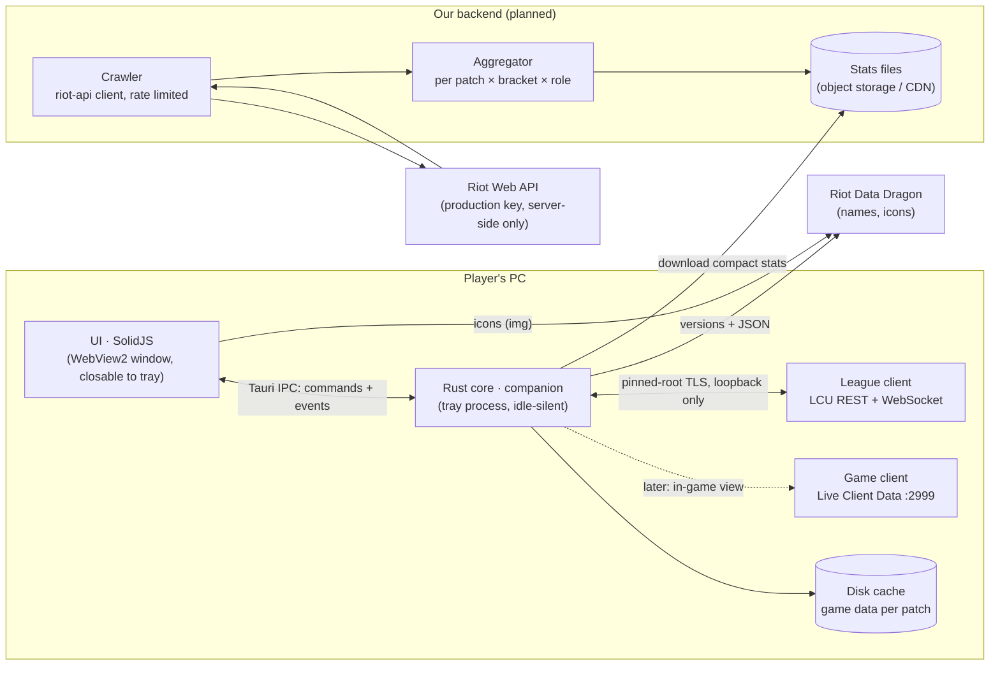

# Architecture

## Principles
- **The core owns data, the UI renders it.** Every UI-facing type lives in `crates/domain` and is
  exported to TypeScript; the UI reaches the core only through `ui/src/data/transport.ts`
  (Tauri IPC in the app, scripted mock scenarios in a browser, HTTP later for a web version).
- **Light next to League.** No overlay, no injection, no polling loops in the UI; the webview can
  be closed while the core keeps following the client from the tray. Budgets and an idle-work
  test guard this in CI, plus a real-app memory/CPU check on Windows.
- **Privacy and policy by construction.** Hidden players' identities are never deserialized from
  the champ-select session. The Riot API key only exists on our server. See `policy.md`.
- **Stats are transparent.** The draft model (`crates/stats/src/draft`) is additive log-odds with
  empirical-Bayes shrinkage: every number comes with its games, weight and uncertainty.

## Settings and automations
- **Settings** (`domain::Settings`) are owned by the core: `companion::settings::SettingsStore` loads
  `settings.json` from the app config dir at start (missing/corrupt → defaults), saves every change
  atomically (temp file + fsync + rename) and publishes it on a watch channel. The UI reads and
  writes them with `get_settings` / `update_settings` and follows the `settings` event.
- **Automations** run in the core (`companion::automation`), so they work with the window closed:
  auto-accept (opt-in, delayed, once per ready check, see policy.md) and the `Autopilot`, which
  turns gameflow phases into window intents: focus in champ select, Draft → Live → Home as the game
  goes. The UI reports every view it shows (`view_changed`), so a page the player opened is never
  switched away from.
- **Shell**: the window is created on demand (launch, tray, champ select); closing it frees the
  webview and, with *close to tray*, the app stays in the tray. A `navigate` event moves the UI; a
  window created for an intent opens directly on its view. *Launch at startup* uses
  tauri-plugin-autostart and starts in the tray (`--autostart`).

## Crates
| Crate | Role |
| --- | --- |
| `domain` | UI-facing types (serde + ts-rs) |
| `lcu` | League client: discovery, pinned TLS, REST, WAMP events, connector lifecycle |
| `mock-lcu` | fake League client for tests and development |
| `companion` | Tauri-free core: client status, champ select → `DraftView`, settings, automations |
| `static-data` | Data Dragon download + per-patch cache + offline fallback |
| `stats` | statistics and the draft model |
| `riot-api` | Riot Web API client for the backend (rate limits, retries) |
| `apps/desktop` | Tauri shell: window, tray, commands, event bridge |
