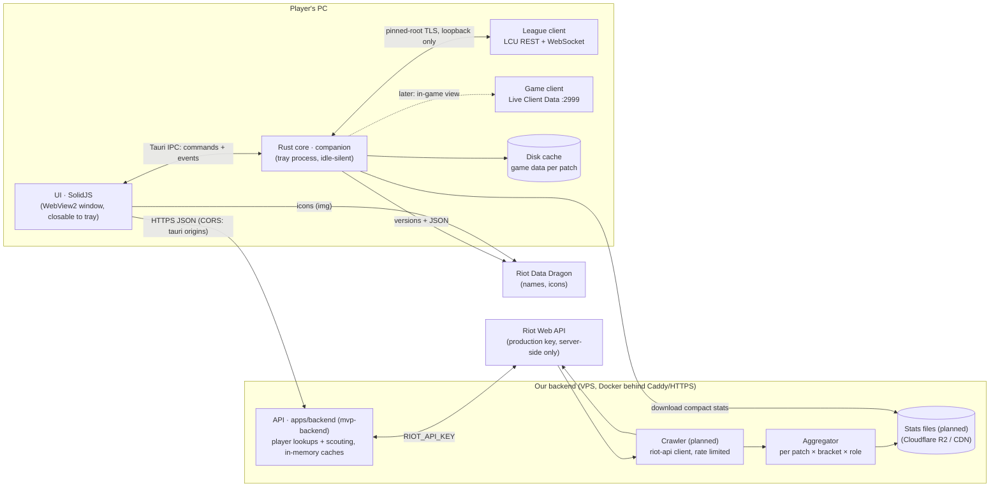

# Architecture

## Principles
- **The core owns data, the UI renders it.** Every UI-facing type lives in `crates/domain` and is
  exported to TypeScript; the UI reaches the core only through `ui/src/data/transport.ts`
  (Tauri IPC in the app, scripted mock scenarios in a browser, HTTP later for a web version).
- **Light next to League.** No overlay, no injection, no polling loops in the UI; the webview can
  be closed while the core keeps following the client from the tray. Budgets and an idle-work
  test guard this in CI, plus a real-app memory/CPU check on Windows.
- **Privacy and policy by construction.** Hidden players' identities are never deserialized from
  the champ-select session. The Riot API key only exists on our server. See `policy.md`.
- **Stats are transparent.** The draft model (`crates/stats/src/draft`) is additive log-odds with
  empirical-Bayes shrinkage: every number comes with its games, weight and uncertainty.

## Backend API (`apps/backend`)
The only holder of the Riot API key. JSON, camelCase, types from `crates/domain` (so the UI gets
TypeScript types); failures answer `ApiError` `{ error, message, retryAfter? }`.

| Route | Answer |
| --- | --- |
| `GET /health` | `Health` `{ ok, version, riotKey }` |
| `GET /v1/players/{platform}/{gameName}/{tagLine}` | `PlayerProfile` · 400 bad platform · 404 · 429 + `retryAfter` · 503 without key |
| `POST /v1/players/batch` `{ platform, puuids ≤ 10 }` | `ScoutCard[]` for loading-screen scouting |

Scout cards carry the Riot ID next to the PUUID and positive/neutral tags only (OTP, main role,
hot streak, veteran). Caches in memory with request coalescing: profiles and cards 2 min,
accounts 1 day, compacted match documents forever (LRU-bounded). Lookups share one rate
limiter per routing value; a 429 is reported to the caller rather than waited out when Riot asks
for more than 5 s. Run and deploy: `apps/backend/README.md`.

## Crates
| Crate | Role |
| --- | --- |
| `domain` | UI-facing types (serde + ts-rs) |
| `lcu` | League client: discovery, pinned TLS, REST, WAMP events, connector lifecycle |
| `mock-lcu` | fake League client for tests and development |
| `companion` | Tauri-free core: client status, champ select → `DraftView` |
| `static-data` | Data Dragon download + per-patch cache + offline fallback |
| `stats` | statistics and the draft model |
| `riot-api` | Riot Web API client for the backend (rate limits, retries) |
| `players` | Riot data → `PlayerProfile` / `ScoutCard` (behind a `RiotSource` trait the backend caches) |
| `apps/desktop` | Tauri shell: window, tray, commands, event bridge |
| `apps/backend` | `mvp-backend` HTTP service: player lookups and scouting, key server-side |
