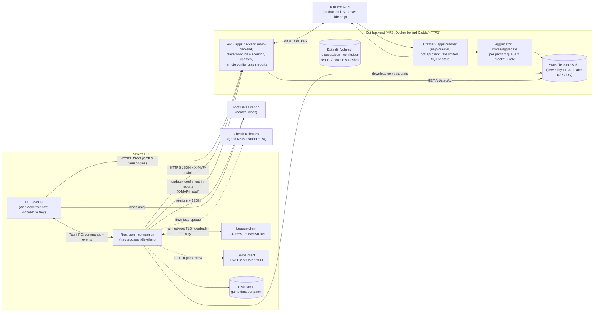

# Architecture



## Principles
- **The core owns data, the UI renders it.** Every UI-facing type lives in `crates/domain` and is
  exported to TypeScript; the UI reaches the core only through `ui/src/data/transport.ts`
  (Tauri IPC in the app, scripted mock scenarios in a browser, HTTP later for a web version).
- **Light next to League.** No overlay, no injection, no polling loops in the UI; the webview can
  be closed while the core keeps following the client from the tray. Budgets and an idle-work
  test guard this in CI, plus a real-app memory/CPU check on Windows.
- **Privacy and policy by construction.** Hidden players' identities are never deserialized from
  the champ-select session. The Riot API key only exists on our server. See `policy.md`.
- **Stats are transparent.** The draft model (`crates/stats/src/draft`) is additive log-odds with
  empirical-Bayes shrinkage: every number comes with its games, weight and uncertainty.

## Backend API (`apps/backend`)
The only holder of the Riot API key. JSON, camelCase, types from `crates/domain` (so the UI gets
TypeScript types); failures answer `ApiError` `{ error, message, retryAfter? }`.

| Route | Answer |
| --- | --- |
| `GET /health` | `Health` `{ ok, version, riotKey }` |
| `GET /v1/players/{platform}/{gameName}/{tagLine}` | `PlayerProfile` · 400 bad platform · 404 · 429 + `retryAfter` · 503 without key |
| `POST /v1/players/batch` `{ platform, puuids ≤ 10 }` | `ScoutCard[]` for loading-screen scouting |
| `GET /v1/stats/index` | `StatsIndex` (published patches, `current`) · ETag, `max-age=300` |
| `GET /v1/stats/{patch}/{queue}/{file…}` | published stats files (below) · ETag/304, `max-age=3600` · 404 when absent |
| `GET /v1/updates/{target}/{arch}/{version}?channel=` | 204 or the Tauri updater manifest (staged rollout, channels, blocked releases) |
| `GET /v1/config?version=&channel=` | `RemoteConfig` (feature flags, kill switches, min version, banners) · `ETag`/304 |
| `POST /v1/reports` | opt-in `CrashReport`, scrubbed of personal data, kept 30 days |
| `GET /metrics` | Prometheus text (admin address or bearer token) |

Scout cards carry the Riot ID next to the PUUID and positive/neutral tags only (OTP, main role,
hot streak, veteran). Caches in memory with request coalescing: profiles and cards 2 min,
accounts 1 day, compacted match documents forever (LRU-bounded); accounts and matches are
snapshotted to the data dir on shutdown. Lookups share one rate limiter per routing value; a
429 is reported to the caller rather than waited out when Riot asks for more than 5 s.

Platform services (`apps/backend/src/ops.rs` and siblings) sit next to the Riot routes:
- **Updates:** releases are described in `releases.json` (edited by `mvp-backend release
  add|promote|block`), served in the Tauri v2 updater format. Staged rollouts bucket installs
  by `SHA-256(install id, version)`, so an install's answer is stable; beta follows stable too;
  blocked releases are never offered and never downgraded from (the fix is forced instead).
  The release workflow signs the installer (`createUpdaterArtifacts`, key in CI secrets).
- **Remote config:** `config.json`, validated at load and re-read when its mtime changes (no
  watcher, no polling); the app applies kill switches immediately.
- **Reports:** opt-in only, scrubbed (Riot IDs, PUUIDs, user names in paths, e-mails,
  credentials, IPs), per-install rate limited, daily JSONL files pruned after 30 days,
  erasable per install id (`mvp-backend reports forget`).
- **Hardening:** every request gets an id, a span and metrics; `/v1/*` is rate limited per
  `X-MVP-Install` (else IP) with 429 + `Retry-After`; body limits and a 45 s timeout; JSON logs
  in production; graceful shutdown.

Run, deploy, data dir layout and privacy: `apps/backend/README.md`.

## Backend client (`companion::backend`)
The app reaches the backend **from the core**, never from the webview: the UI calls Tauri commands
(`search_player`, `live_game`, `retry_scouting`, the stats commands below) and the core makes the
HTTPS request.
- **Base URL**: `MVP_BACKEND_URL` at **build time** (`MVP_BACKEND_URL=https://api… pnpm build:exe`);
  without it, `http://127.0.0.1:8787` (a local `pnpm backend`). **Debug builds** also read
  `MVP_BACKEND_URL` at run time, to point a dev app anywhere without rebuilding:
  `MVP_BACKEND_URL=http://127.0.0.1:8787 pnpm app`. The CSP's `connect-src` lists the local origin;
  add the production origin there once it exists (only needed if the webview ever calls it directly).
- **Install id**: a random 128-bit hex id in `install-id` next to `settings.json`, sent as
  `X-MVP-Install` on every request (anonymous; lets the server rate-limit per install).
- **Timeouts**: connect 5 s, lookups 20 s, scouting batches 35 s (the server gives up at 30 s).
- **Errors** map to `domain::BackendError` (`notFound`, `rateLimited { retryAfter }`,
  `unavailable { message }`, `network { message }`); commands reject with it and the UI words it.

## Loading-screen scouting (`companion::live`)
When the phase reaches Loading or InGame the core reads `GET /lol-gameflow/v1/session` once per
game (both teams: PUUID, Riot ID, champion, position; spells from `playerChampionSelections`),
publishes a `LiveGame` (our team first), then asks `POST /v1/players/batch` for the visible
players and fills the cards in place (`live` event). Streamer-mode players
(`nameVisibilityType: HIDDEN`) are dropped before anything else: no Riot ID, no PUUID, no lookup.
Champion select is never read for identities. The game ending clears the view; a failed batch is
shown in the page head with a retry (`retry_scouting`).

## Search (title bar)
Champions match locally and instantly (fuzzy: prefix, word, initials, subsequence); a Riot ID
(`Name#TAG`) adds a player row that is looked up in the background (debounced 300 ms) and fills in
place. The rows are a pure function of the typed text, so Enter always opens what is highlighted
when it is pressed. Lookups are shared with the player page (2 min in memory, failures not cached).
Recent searches (max 8) and the region live in `localStorage`.

## Settings and automations
- **Settings** (`domain::Settings`) are owned by the core: `companion::settings::SettingsStore` loads
  `settings.json` from the app config dir at start (missing/corrupt → defaults), saves every change
  atomically (temp file + fsync + rename) and publishes it on a watch channel. The UI reads and
  writes them with `get_settings` / `update_settings` and follows the `settings` event.
- **Automations** run in the core (`companion::automation`), so they work with the window closed:
  auto-accept (opt-in, delayed, once per ready check, see policy.md) and the `Autopilot`, which
  turns gameflow phases into window intents: focus in champ select, Draft → Live → Home as the game
  goes. The UI reports every view it shows (`view_changed`), so a page the player opened is never
  switched away from.
- **Shell**: the window is created on demand (launch, tray, champ select); closing it frees the
  webview and, with *close to tray*, the app stays in the tray. A `navigate` event moves the UI; a
  window created for an intent opens directly on its view. *Launch at startup* uses
  tauri-plugin-autostart and starts in the tray (`--autostart`).

## Window backdrop (`ui/src/design/backdrop`)
The ambient light behind the shell is one WebGL 1 canvas (first child of `[data-ambient-host]`,
fixed, `z-index: -1`, `aria-hidden`, `data-free-style`), drawn **on demand only**. Nothing runs at
rest: no rAF loop, no timers (the perf suite asserts 0 renders over 3 s, and a median render
≤ 2 ms of CPU).
- **What wakes it**: the page light changing (a MutationObserver on the host's inline `--amb-*`,
  written by `ambient.ts`; the 450/600 ms glide is mirrored in JS, a frame each only while it
  runs), a ResizeObserver on the host and on the glass panes, a DOM change under the host (panes
  come and go), and scrolling of a container that holds panes (rAF-coalesced).
- **Two cheap passes**: (1) the light, glows bent by 2 octaves of value noise with a faint satin
  sheen, into a texture at 1/8 of CSS px, redrawn only when the light or the window size changes;
  (2) per render, into a canvas at ½ CSS px (device pixel ratio capped at 1, scaled up by CSS): the
  texture plus a soft hex mosaic (a 128² tile drawn once) and a dither, then one quad per glass
  pane in a single draw call. Panes are elements marked `data-refract` (`="chrome"` for the title
  bar and rail; at most 16). Inside a pane's rounded-rect SDF the backdrop is sampled through a
  slight lens and a 22 px bevel that pulls the light in from beyond the edge, gathers it, and adds a
  faint top-lit rim. Pattern and gathering scale the light's difference from `--bg-0`, so dark
  areas and text backgrounds stay as they were (text contrast is unchanged vs the CSS light).
- **Levels** (`effects`, saved in localStorage `mvp.effects`; shown on `<html data-effects>`):
  `auto` (default) → `shader`, falling back to `css` when WebGL is missing, the first frame takes
  more than 8 ms GPU included (software rendering, weak GPU), or the context is lost (back to
  `shader` when restored); `prefers-reduced-transparency` → `css`; `prefers-reduced-motion` keeps the
  shader but skips glides. `light` → `css`, the static gradients. `off` → `flat`: `--bg-0` only and
  no backdrop blur. `data-effects-fallback` says why a fallback happened.
- **Tests**: headless Chromium renders with SwiftShader, which the speed probe rightly rejects, so
  `tests/app.ts` sets `window.__MVP_TRUST_WEBGL__` to keep the shader in every suite
  (`webgl: "probe" | "missing"` exercises the fallbacks, `tests/backdrop.spec.ts`).

## Stats pipeline (`apps/crawler` + `crates/aggregate`)
Server-side only (the Riot key never leaves it). Checkpoint 2 scope: **Emerald+**, ranked solo
(420) and **ARAM** (450), current patch with fallback to the previous one.

```text
crawl:   ladder pages (Emerald I–IV, Diamond I–IV, Master/GM/Challenger) → PUUIDs
         → match ids (420 + 450, last N days) → match + timeline → GameFacts → SQLite
publish: SQLite facts of a patch (+ the previous patch) → Dataset → JSON files → STATS_DIR/v1/…
serve:   mvp-backend GET /v1/stats/… (ETag, Cache-Control) → the app downloads and caches
```

- **Crawl state** (`{data dir}/crawl.sqlite`, rusqlite bundled): ladder pages read, players (with
  the bracket they were seeded from and when their history was last read), pending match ids,
  and every fetched match (primary key = match id → never counted twice) with its extracted
  facts or the reason it isn't counted. Any run can stop anytime and the next one resumes. Every
  call goes through `riot-api`'s header-driven limiter; the crawler waits out 429s (a dev key
  just crawls slowly). Brackets are rotated so each gets its share.
- **Facts** (`aggregate::extract`): patch from `gameVersion` (`16.19.712.4` → `16.19`, public
  `26.19`), queue, bans (once per game), and per player: team, win, champion, `teamPosition`,
  spells, full rune page, skill level-ups and net purchases (undos removed) from the timeline.
  No PUUIDs or names are kept. Skipped: other queues, remakes (< 5 min or early surrender),
  ranked games without one of each role per team. A game counts in the bracket of the ladder
  player who surfaced it first (Match-V5 has no rank); brackets publish cumulatively
  (`emeraldPlus` ⊇ `diamondPlus` ⊇ `masterPlus`).
- **Aggregates** (`aggregate::Dataset`, per patch × queue × seed bracket): champion × role
  games/wins (pick counts, role odds), bans, lane-relevant opponents (same role, laner vs enemy
  jungler, bottom vs support), same-team duos (all 10 role pairs), and builds per champion ×
  role: rune pages, keystones, spell pairs, skill max order and first four points, starting
  items (< 1:30), core (first three completed legendaries in order), first upgraded boots, and
  the 4th/5th/6th legendary. Items are classified with the patch's Data Dragon `item.json`.
  Every count is a sum, so `merge` is commutative and results don't depend on game order
  (property-tested); build options are bounded by `compact` (top N + a tail count).
- **Published files** (`aggregate::publish`, types in `crates/domain/src/stats.rs`, exported to
  TS): compact keys (`g` games, `w` wins), raw counts next to every derived number.

| Path under `STATS_DIR` | Type | Contents |
| --- | --- | --- |
| `v1/index.json` | `StatsIndex` | patches (newest first) with games per `{queue, bracket}`, `current` (newest patch with ≥ 20k Emerald+ ranked games, else the previous) |
| `v1/{patch}/{queue}/{bracket}/champions.json` | `ChampionsFile` | per champion: games, wins, bans, roles (g/w, previous patch g/w); draft priors τ/k per pair type (DerSimonian–Laird via `stats::draft::estimate_tau`) |
| `…/tierlist.json` | `TierList` | champion × role: score = shrunk win rate − 50 % (k = 1000), grade S–D, games, pick/ban rates |
| `…/matchups/{championId}.json` | `MatchupsFile` | ranked only; per role: lane, vs enemy jungler, duos — g/w and the shrunk delta `d` in points |
| `…/builds/{championId}.json` | `BuildsFile` | per role: runes, keystones, spells, skills, skill start, starts, core, boots, item 4/5/6 — each `{ n, top: [{ ids, g, w }] }` |

`{bracket}` is `emeraldPlus`, `diamondPlus` or `masterPlus`. Each patch directory is replaced
atomically on publication; the index is written last.

**Next (not built):** upload `STATS_DIR` to Cloudflare R2 behind a CDN after each publish
(credentials only on the VPS, never in the repo) and point the app at it; a schedule (cron /
systemd timer) for crawl + publish; per-platform crawls merged for more volume.

## Stats in the app (`companion::stats`, `companion::draft`)
The core downloads the published files through the backend client (same base URL, install id,
timeouts and `BackendError`s) and the UI asks the core, never the backend:

| Command / event | Answer |
| --- | --- |
| `stats_index` | `StatsIndex \| null`: the index as last fetched (`null`: nothing published, or offline without a cached copy); a stale one is revalidated in the background |
| `tier_list { queue, bracket }` | `TierList` of the current patch · rejects with a `BackendError` (`notFound` when neither published nor cached) |
| `champion_stats { championId, queue, bracket }` | `ChampionPage` from `champions.json` (record), `tierlist.json` (its rows, best role first), `builds/{id}.json`, `matchups/{id}.json` (ranked only); an unpublished file leaves its part empty, `notFound` only when the data set doesn't exist |
| event `stats-index` | `StatsIndex`: a different index arrived (new patch, republication): stats views refetch |

- **Disk cache** under the app cache dir, in the server's layout: `stats/v1/index.json`,
  `stats/v1/{patch}/{queue}/{bracket}/{file}`, each with its `ETag` in `{file}.etag` (atomic
  writes). Only the index's current patch and the one before it stay on disk.
- **When the network is used** (never on a timer): the index at startup (`If-None-Match`), then at
  most once per its `max-age` (5 min) when something asks for stats, e.g. champion select
  starting; a stale index answers at once and is revalidated in the background. Data files don't
  change within a publication and carry its time (`info.updatedAt` = the index's
  `PatchIndex.updatedAt`): a cached file of the current generation is served with no request;
  otherwise `If-None-Match` (304 → the disk copy), and a 404 is remembered for that generation.
  Requests for one file are coalesced; a 429 pauses every request for its `Retry-After` (the
  backend allows 60 at once, 120/min per install, shared with lookups). Parsed files live in a
  64-file LRU.
- **Offline or failing**: the cached copy (any generation), else the previous patch's copy,
  else the error.

**Draft helper** (`companion::draft`, a task of its own next to the core's event loop): the loop
maps each champ-select session (teams only) and hands it over; the helper re-publishes it at
once when nothing the model reads changed, else after one evaluation on a blocking thread
(~1 ms per pick in release). What it adds to `DraftView`: `team` (our win chance: locked picks
and allies' hovers; your own hover only once you lock in), `suggestions` (≤ 15, tiers of
statistically tied picks, reasons), `data` (bracket, public patch name, games, updated) and each
enemy's `role`/`roleOdds` (≥ 5 %).
- **Data**: ranked solo/duo, Emerald+, current patch. `stats::draft::DraftData` over
  `champions.json` (base strength = this patch shrunk toward the previous patch's win rate in
  the role, which is itself shrunk toward 50 % — 47 % off-meta — with 1k games; prior strength
  `n_prev·k_d/(n_prev+k_d)`, `k_d` = 20k, 1.5k when the win rate moved with |z| > 3) and the
  published pair priors; pair evidence from the `matchups/{id}.json` of the champions in the
  draft, both perspectives averaged (a laner's file is the only one with its games against the
  enemy jungler, so the candidates' files load too once an enemy is locked). Enemy roles from
  each champion's role shares over every consistent assignment.
- **Candidates, pool-first**: your hover/pick, your recent Summoner's Rift games in the role
  (`/lol-match-history/…`), your mastery on champions that play the role (≥ 10 % of their
  games), then the role's tier list so the list is never empty — only champions you can pick
  (`/lol-champ-select/v1/pickable-champion-ids`, not banned, not taken). `mine` = your games on
  the pick in the role, `mastery` = your mastery of it. No ban suggestions.
- **Loads**: at champ-select start, the pool (3 LCU reads) and the data set (index, champions,
  tier list); matchups files as champions appear (≤ 4 in flight). Arrivals within 30 ms are
  evaluated once. Without stats (no backend, nothing published, offline without cache) the draft
  shows the teams only (`data: null`, no suggestions); without assigned roles (blind, ARAM), no
  suggestions.

## Crates
| Crate | Role |
| --- | --- |
| `domain` | UI-facing types (serde + ts-rs) |
| `lcu` | League client: discovery, pinned TLS, REST, WAMP events, connector lifecycle |
| `mock-lcu` | fake League client for tests and development |
| `companion` | Tauri-free core: client status, champ select → `DraftView` (+ draft helper), loading screen → `LiveGame`, settings, automations, backend client, stats download + disk cache |
| `static-data` | Data Dragon download + per-patch cache + offline fallback |
| `stats` | statistics and the draft model |
| `aggregate` | stats pipeline core: Match-V5 → facts → mergeable aggregates → published JSON |
| `riot-api` | Riot Web API client for the backend (rate limits, retries) |
| `players` | Riot data → `PlayerProfile` / `ScoutCard` (behind a `RiotSource` trait the backend caches) |
| `apps/desktop` | Tauri shell: window, tray, commands, event bridge |
| `apps/backend` | `mvp-backend` HTTP service: player lookups, scouting, published stats files (key server-side), app updates, remote config, crash reports, admin CLI |
| `apps/crawler` | `mvp-crawler`: crawl (Riot API → SQLite) and publish (→ `stats/v1/…`) |
